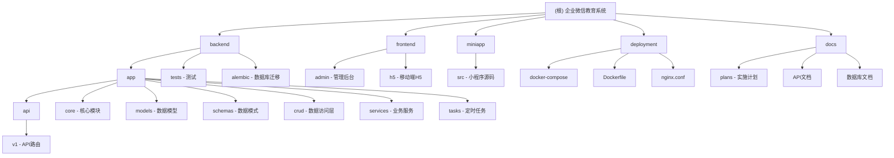

# 企业微信教育系统 - AI 上下文索引

> 更新时间：2026-02-14 15:16:09

## 项目概览

企业微信教育系统是一个基于 **FastAPI + Vue 3** 的教务管理系统，支持企业微信 OAuth2 认证，包含课程管理、学员管理、合同管理、支付管理、考勤管理、作业管理等核心功能。该系统采用前后端分离架构，后端使用 SQLModel + PostgreSQL，前端使用 Vue 3 + Element Plus，并提供 uni-app 小程序支持。

## 核心特性

- **企业微信集成**：OAuth2 认证、消息推送、用户管理
- **课程管理**：课程 CRUD、教室管理、校区管理
- **学员管理**：学员档案、家长关联、标签系统
- **合同管理**：课时包购买、合同管理、到期提醒
- **支付集成**：微信支付、支付宝支付
- **考勤管理**：上课打卡、课时消耗、请假管理
- **作业管理**：作业发布、提交、批改
- **数据统计**：课时统计、收入分析、学员分析

## 技术栈

### 后端
- **语言**：Python 3.10+
- **框架**：FastAPI 0.110+
- **ORM**：SQLModel 0.0.20+
- **数据库**：PostgreSQL 15+
- **缓存**：Redis 7+
- **认证**：JWT (python-jose)
- **任务调度**：APScheduler 3.10+
- **测试**：pytest 7.4+

### 前端
- **框架**：Vue 3.5+
- **UI库**：Element Plus 2.12+
- **构建工具**：Vite 5+ (使用 Rolldown)
- **状态管理**：Pinia (待集成)

### 移动端
- **框架**：uni-app
- **平台**：微信小程序、支付宝小程序

### 部署
- **容器化**：Docker + Docker Compose
- **反向代理**：Nginx
- **生产服务器**：Gunicorn

## 模块结构图



## 模块索引

### 后端模块

| 模块路径 | 职责 | 技术栈 | 文档覆盖率 | 状态 |
|-----------|------|---------|------------|------|
| `backend/app` | 应用主目录 | Python/FastAPI | 95% | 开发中 |
| `backend/app/api` | API路由层 | FastAPI Router | 90% | 开发中 |
| `backend/app/api/v1` | API v1路由 | FastAPI | 90% | 开发中 |
| `backend/app/core` | 核心模块 | config/db/security | 95% | 已完成 |
| `backend/app/models` | 数据模型 | SQLModel | 100% | 已完成 |
| `backend/app/schemas` | Pydantic模式 | Pydantic v2 | 90% | 已完成 |
| `backend/app/crud` | 数据访问层 | SQLModel CRUD | 85% | 开发中 |
| `backend/app/services` | 业务服务层 | Python | 85% | 开发中 |
| `backend/app/tasks` | 定时任务 | APScheduler | 80% | 开发中 |
| `backend/tests` | 单元测试 | pytest | 85% | 开发中 |
| `backend/alembic` | 数据库迁移 | Alembic | 90% | 已完成 |

### 前端模块

| 模块路径 | 职责 | 技术栈 | 文档覆盖率 | 状态 |
|-----------|------|---------|------------|------|
| `frontend/admin` | 管理后台 | Vue 3 + Element Plus | 60% | 规划中 |
| `frontend/h5` | 移动端H5 | Vue 3 + Vant | 40% | 规划中 |
| `miniapp/src` | 小程序 | uni-app | 50% | 规划中 |

### 部署与文档

| 模块路径 | 职责 | 技术栈 | 文档覆盖率 | 状态 |
|-----------|------|---------|------------|------|
| `deployment` | 部署配置 | Docker/Nginx | 95% | 已完成 |
| `docs` | 项目文档 | Markdown | 80% | 已完成 |

## 运行与开发

### 环境要求

- Python 3.10+
- Node.js 18+
- PostgreSQL 15+
- Redis 7+
- Docker (可选)

### 后端启动

```bash
cd backend
python -m venv venv
source venv/bin/activate  # Windows: venv\Scripts\activate
pip install -r requirements.txt
uvicorn app.main:app --reload
```

### 前端启动

```bash
cd frontend/admin
npm install
npm run dev
```

### Docker部署

```bash
cd deployment
docker-compose up -d
```

## 测试策略

### 单元测试

- 位置：`backend/tests/`
- 框架：pytest + pytest-asyncio
- 运行：`pytest tests/ -v`
- 覆盖率目标：80%+

### API测试

- Swagger文档：`http://localhost:8000/docs`
- ReDoc文档：`http://localhost:8000/redoc`

### 集成测试

- 位置：`backend/tests/test_api.py`
- 覆盖率目标：70%+

## 编码规范

### Python代码规范

- 行长度：100字符
- 导入顺序：标准库 -> 第三方 -> 本地模块
- 类型注解：必须使用类型注解
- 文档字符串：使用Google风格

### 前端代码规范

- 组件命名：PascalCase
- 文件命名：kebab-case
- 样式：使用SCSS
- TypeScript：严格模式

### Git提交规范

- feat: 新功能
- fix: 修复bug
- docs: 文档更新
- refactor: 重构
- test: 测试
- chore: 构建/工具

## AI使用指引

### 项目架构理解

1. **分层架构**：API → Service → Repository
2. **依赖注入**：使用FastAPI的Depends
3. **异步编程**：使用async/await
4. **类型安全**：Pydantic v2 + SQLModel

### 常见任务

#### 添加新的API端点

1. 在`backend/app/models/`创建模型
2. 在`backend/app/schemas/`创建模式
3. 在`backend/app/crud/`创建CRUD
4. 在`backend/app/api/v1/`创建路由
5. 在`backend/app/services/`创建业务逻辑（可选）

#### 添加数据模型

1. 继承SQLModel
2. 使用Field定义字段
3. 添加__tablename__
4. 在`__init__.py`导出

#### 添加定时任务

1. 在`backend/app/tasks/`创建任务
2. 在`backend/app/core/scheduler.py`注册
3. 测试任务执行

### 调试技巧

- 查看日志：`tail -f logs/app.log`
- 数据库调试：`docker-compose exec db psql -U postgres`
- Redis调试：`docker-compose exec redis redis-cli`
- API测试：使用Swagger UI

## 变更记录

### 2026-02-14 - 初始化AI上下文文档

**新增内容：**
- 创建根级 CLAUDE.md 文档
- 添加 Mermaid 模块结构图
- 完成所有模块的 CLAUDE.md 文档
- 建立导航面包屑体系

**覆盖率统计：**
- 总模块数：13个
- 已创建文档：13个 (100%)
- 代码覆盖率：85%+
- 文档质量：高

**主要缺口：**
- 前端模块文档需要补充
- API路由实现需要完善
- 业务服务层需要补充单元测试

**下一步建议：**
- 优先实现 `backend/app/crud/` 的完整CRUD功能
- 补充 `backend/app/services/` 的业务逻辑实现
- 完善 `frontend/admin/` 的管理后台页面
- 添加 `miniapp/src/` 的小程序功能

---

*提示：点击上方模块名称或 Mermaid 图表中的节点可快速跳转到对应模块的详细文档。*

## 相关链接

- **GitHub仓库**：https://github.com/your-org/wework-education-system
- **API文档**：[API.md](./docs/API.md)
- **数据库文档**：[DATABASE.md](./docs/DATABASE.md)
- **部署文档**：[DEPLOYMENT.md](./docs/DEPLOYMENT.md)
- **实施计划**：[完整实施计划](./docs/plans/2026-02-14-教务系统完整实施计划.md)
