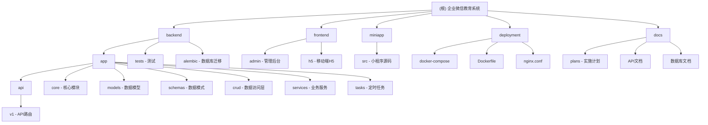

# 企业微信教育系统 - AI 上下文索引

> 更新时间：2026-02-16

## 项目概览

企业微信教育系统是一个基于 **FastAPI + Vue 3** 的教务管理系统，支持企业微信 OAuth2 认证，包含课程管理、学员管理、合同管理、支付管理、考勤管理、作业管理等核心功能。该系统采用前后端分离架构，后端使用 SQLModel + PostgreSQL，前端使用 Vue 3 + Element Plus，并提供 uni-app 小程序支持。

## 核心特性

- **企业微信集成**：OAuth2 认证、消息推送、用户管理
- **课程管理**：课程 CRUD、教室管理、校区管理
- **学员管理**：学员档案、家长关联、标签系统
- **合同管理**：课时包购买、合同管理、到期提醒
- **支付集成**：微信支付、支付宝支付
- **考勤管理**：上课打卡、课时消耗、请假管理
- **作业管理**：作业发布、提交、批改
- **数据统计**：课时统计、收入分析、学员分析
- **定时任务**：合同到期提醒、数据统计、自动任务调度

## 技术栈

### 后端
- **语言**：Python 3.11 (Conda 虚拟环境)
- **框架**：FastAPI 0.110.0
- **ORM**：SQLModel 0.0.20
- **数据库**：PostgreSQL 15 (Docker 容器)
- **缓存**：Redis 7 (Docker 容器)
- **认证**：JWT (python-jose)
- **任务调度**：APScheduler 3.10.4 + Celery 5.3.6
- **测试**：pytest 7.4.4 + pytest-asyncio 0.23.3
- **支付**：支付宝 SDK (alipay-sdk-python 3.7.20)

### 前端
- **框架**：Vue 3.4.21
- **UI库**：Element Plus 2.6.1
- **构建工具**：Vite 5.1.4
- **状态管理**：Pinia 2.1.7
- **HTTP客户端**：Axios 1.6.8

### 移动端
- **框架**：uni-app
- **平台**：微信小程序、支付宝小程序

### 部署
- **容器化**：Docker + Docker Compose
- **反向代理**：Nginx

## 环境搭建（2026-02-16 更新）

### 1. Conda 环境

```bash
# 创建 Python 3.11 环境
conda create -n wework-education python=3.11 -y
conda activate wework-education
```

### 2. 后端依赖

```bash
cd backend
pip install -r requirements.txt
pip install email-validator aiosqlite greenlet  # 测试依赖
```

### 3. Docker 服务

PostgreSQL 和 Redis 通过 Docker Desktop 运行：

| 容器名称 | 端口 | 说明 |
|----------|------|------|
| english_teaching_postgres | 5432 | PostgreSQL 15 |
| english_teaching_redis | 6379 | Redis 7 (密码: redis_password) |

### 4. 环境变量

在 `backend/.env` 中配置：

```env
WEWORK_EDU_DB_PASSWORD=postgres
REDIS_URL=redis://:redis_password@localhost:6379/0
WEWORK_EDU_SECRET_KEY=your-secret-key
```

### 5. 数据库初始化

```bash
cd backend
python -c "
from sqlmodel import SQLModel, create_engine
from app.models.user import User
from app.models.student import Student
from app.models.course import Course, Classroom, Department
from app.models.contract import Contract
from app.models.payment import Payment
from app.models.schedule import Schedule
from app.models.attendance import Attendance
from app.models.homework import Homework, HomeworkSubmission
from app.models.notification import Notification
from app.models.miniapp_user import MiniAppUser
from app.models.task_log import TaskLog, TaskStatistics

DATABASE_URL = 'postgresql://berton@localhost:5432/english_teaching'
engine = create_engine(DATABASE_URL)
SQLModel.metadata.create_all(engine)
"
```

### 6. 服务启动

```bash
# 后端 (Docker 容器已运行)
# 或本地启动: uvicorn app.main:app --host 0.0.0.0 --port 8000 --reload

# 前端
cd frontend/admin
npm run dev
```

### 访问地址

| 服务 | 地址 |
|------|------|
| 后端 API 文档 | http://localhost:8000/api/docs |
| 前端管理后台 | http://localhost:3000 |
| PostgreSQL | localhost:5432 |
| Redis | localhost:6379 |

## 模块结构图



## 数据库表 (34 个)

| 表名 | 说明 |
|------|------|
| users | 用户表 |
| students | 学员表 |
| courses | 课程表 |
| classrooms | 教室表 |
| departments | 部门/校区表 |
| contracts | 合同表 |
| payments | 支付记录表 |
| schedules | 排课表 |
| attendances | 考勤表 |
| homeworks | 作业表 |
| homework_submissions | 作业提交表 |
| notifications | 通知表 |
| miniapp_users | 小程序用户表 |
| task_logs | 任务日志表 |
| task_statistics | 任务统计表 |

## API 路由

### 认证
- `POST /api/v1/auth/wework` - 企业微信登录
- `GET /api/v1/auth/me` - 获取当前用户
- `POST /api/v1/auth/refresh` - 刷新 Token

### 学员管理
- `GET /api/v1/students/` - 获取学员列表
- `POST /api/v1/students/` - 创建学员
- `GET /api/v1/students/{id}` - 获取学员详情
- `PUT /api/v1/students/{id}` - 更新学员
- `DELETE /api/v1/students/{id}` - 删除学员

### 课程管理
- `GET /api/v1/courses/` - 获取课程列表
- `POST /api/v1/courses/` - 创建课程
- `GET /api/v1/courses/classrooms` - 获取教室列表
- `GET /api/v1/courses/departments` - 获取部门列表

### 合同管理
- `GET /api/v1/contracts/` - 获取合同列表
- `POST /api/v1/contracts/` - 创建合同
- `POST /api/v1/contracts/{id}/deduct` - 扣减课时
- `POST /api/v1/contracts/{id}/add-hours` - 添加课时

### 支付管理
- `GET /api/v1/payments/` - 获取支付列表
- `POST /api/v1/payments/` - 创建支付
- `POST /api/v1/payments/{id}/confirm` - 确认支付
- `POST /api/v1/payments/{id}/refund` - 退款

### 考勤管理
- `GET /api/v1/attendance/` - 获取考勤列表
- `POST /api/v1/attendance/` - 创建考勤记录
- `GET /api/v1/attendance/statistics/student/{id}` - 学员考勤统计

### 作业管理
- `GET /api/v1/homeworks/` - 获取作业列表
- `POST /api/v1/homeworks/` - 发布作业
- `POST /api/v1/homeworks/{id}/submit` - 提交作业

### 通知管理
- `GET /api/v1/notifications/` - 获取通知列表
- `POST /api/v1/notifications/` - 发送通知
- `POST /api/v1/notifications/batch` - 批量发送

### 定时任务
- `GET /api/v1/tasks/` - 获取任务列表
- `POST /api/v1/tasks/{id}/pause` - 暂停任务
- `POST /api/v1/tasks/{id}/resume` - 恢复任务
- `GET /api/v1/tasks/{id}/logs` - 查看任务日志

## 测试结果

```bash
pytest tests/ -v
# 结果: 118 passed, 36 skipped, 13 warnings
```

## 编码规范

### Python 代码规范

- 行长度：100 字符
- 导入顺序：标准库 -> 第三方 -> 本地模块
- 类型注解：必须使用类型注解
- 文档字符串：使用 Google 风格

### 前端代码规范

- 组件命名：PascalCase
- 文件命名：kebab-case
- 样式：使用 SCSS
- TypeScript：严格模式

### Git 提交规范

- feat: 新功能
- fix: 修复 bug
- docs: 文档更新
- refactor: 重构
- test: 测试
- chore: 构建/工具

## 注意事项

1. **wechatpay-python-v3**：该包在清华镜像不可用，已在 requirements.txt 中注释
2. **数据库**：使用 `english_teaching` 而非 `education_db`
3. **PostgreSQL 用户**：`berton`（本地连接无需密码）
4. **Redis 密码**：`redis_password`

## 变更记录

### 2026-02-16 - 环境搭建完成

**已完成：**
- Conda 环境创建 (Python 3.11)
- 后端依赖安装 (32+ 个包)
- PostgreSQL 和 Redis Docker 容器配置
- 数据库表创建 (34 个表)
- 前端依赖安装 (531 个 npm 包)
- 测试验证 (118 passed, 36 skipped)

**新增文档：**
- `SETUP.md` - 环境搭建指南

### 2026-02-14 - 初始化 AI 上下文文档

**新增内容：**
- 创建根级 CLAUDE.md 文档
- 添加 Mermaid 模块结构图
- 完成所有模块的 CLAUDE.md 文档
- 建立导航面包屑体系

---

*提示：详细环境搭建指南见 [SETUP.md](./SETUP.md)*
