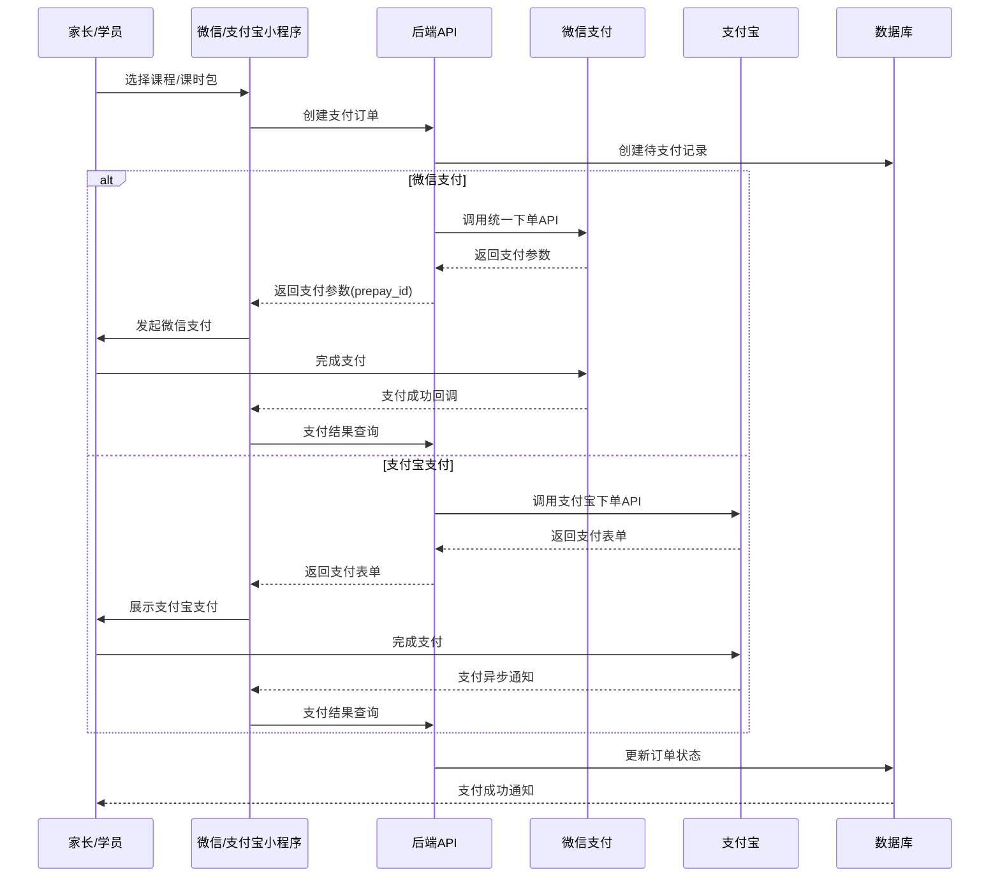

# 企业微信教务系统设计方案（V3.0 完整版）

> 设计时间：2025年
> 设计版本：v3.0（完整商业版）
> 目标用户：个人开发者 + AI辅助开发
> 业务模式：培训机构（课时包收费）

---

## 📋 设计概述

### 核心定位
这是一个为**个人开发者**设计的、基于企业微信的轻量级教务管理系统。针对具有计算机背景但脱离开发较久的开发者，充分利用AI辅助开发能力，实现快速落地。

### 设计原则
- **简单优先**：技术栈选择简单易学的工具
- **渐进开发**：MVP优先，逐步迭代
- **AI友好**：代码结构便于AI理解和生成
- **成本可控**：开发成本<8000元，运营成本<150元/月
- **商业闭环**：完整的招生→报名→缴费→排课→教学→续费流程

---

## 🛠️ 技术栈选型（完整版）

### 后端技术栈

```yaml
语言与框架:
  语言: Python 3.11+
  框架: FastAPI 0.110+
  理由:
    - 异步支持，性能是Flask的3-5倍
    - 自动生成OpenAPI文档
    - 类型提示完善，AI代码生成准确率高
    - 现代Python开发最佳实践

数据层:
  开发数据库: SQLite 3.40+
  生产数据库: PostgreSQL 15+
  ORM: SQLModel 0.0.14+ (Pydantic v2 + SQLAlchemy)
  迁移工具: Alembic
  理由:
    - SQLModel结合了Pydantic和SQLAlchemy优点
    - 类型安全，IDE提示完善
    - 数据验证和数据库模型统一

缓存与队列:
  Redis: 7.0+ (Token缓存 + 会话存储 + 任务队列)
  理由:
    - 企业微信Token多实例共享
    - Celery任务队列后端
    - 热点数据缓存

任务调度:
  定时任务: APScheduler (轻量定时任务)
  异步任务: Celery + Redis (复杂异步处理)
  理由:
    - APScheduler适合简单定时任务（上课提醒）
    - Celery适合批量处理（群发消息、数据统计）

认证与安全:
  认证: JWT (python-jose)
  加密: passlib (bcrypt)
  CORS: fastapi-cors-middleware
  支付签名: itsdangerous (Flask签名工具)
```

### 前端技术栈

```yaml
管理后台:
  框架: Vue 3.4+ (Composition API + <script setup>)
  UI库: Element Plus 2.5+
  状态管理: Pinia 2.1+
  路由: Vue Router 4.2+
  HTTP客户端: axios 1.6+
  构建工具: Vite 5.0+
  理由:
    - 管理员专用，复杂交互优先体验
    - Element Plus组件丰富

移动端H5:
  方式: 企业微信H5页面
  框架: Vue 3 + Vant 4.0+
  理由:
    - H5可在企业微信内直接打开
    - 无需学习小程序语法
    - 一套代码多端运行

微信小程序:
  框架: uni-app (Vue 3语法)
  理由:
    - Vue语法，学习成本低
    - 一套代码同时支持微信、支付宝小程序
    - 编译体积小，加载快
```

### 部署技术栈

```yaml
容器化:
  容器: Docker 24+
  编排: Docker Compose 2.20+

反向代理:
  服务器: Nginx 1.25+
  SSL: Let's Encrypt (certbot)

服务器配置:
  CPU: 2核
  内存: 2GB
  存储: 40GB SSD
  Redis: 1GB (云Redis)
  费用: 约80-110元/月 (腾讯云轻量服务器)
```

---

## 📊 数据库设计（完整版）

### 设计原则
1. **精简表数量**：控制在60张以内
2. **使用InnoDB引擎**：支持事务和外键
3. **统一字符集**：utf8mb4_unicode_ci
4. **优化索引**：根据查询模式建立复合索引

### 核心数据表

```sql
-- =============================================
-- 用户模块
-- =============================================

-- 用户表（教师/员工）
CREATE TABLE users (
    id BIGINT PRIMARY KEY GENERATED ALWAYS AS IDENTITY,
    wework_id VARCHAR(64) UNIQUE NOT NULL,
    name VARCHAR(50) NOT NULL,
    mobile VARCHAR(20),
    avatar VARCHAR(500),
    role VARCHAR(20) NOT NULL DEFAULT 'teacher', -- admin, teacher, finance
    department_id BIGINT,
    status SMALLINT DEFAULT 1, -- 1:active 0:inactive
    created_at TIMESTAMP DEFAULT CURRENT_TIMESTAMP,
    updated_at TIMESTAMP DEFAULT CURRENT_TIMESTAMP
);

CREATE INDEX idx_users_wework_id ON users(wework_id);
CREATE INDEX idx_users_role ON users(role);
CREATE INDEX idx_users_department ON users(department_id);

-- 部门/校区表
CREATE TABLE departments (
    id BIGINT PRIMARY KEY GENERATED ALWAYS AS IDENTITY,
    name VARCHAR(100) NOT NULL,
    parent_id BIGINT REFERENCES departments(id),
    manager_id BIGINT REFERENCES users(id),
    address VARCHAR(200),
    contact VARCHAR(50),
    status SMALLINT DEFAULT 1,
    created_at TIMESTAMP DEFAULT CURRENT_TIMESTAMP
);

-- =============================================
-- 学员模块
-- =============================================

-- 学员表
CREATE TABLE students (
    id BIGINT PRIMARY KEY GENERATED ALWAYS AS IDENTITY,
    name VARCHAR(50) NOT NULL,
    nickname VARCHAR(50),
    gender SMALLINT, -- 1:male 2:female
    birthday DATE,
    mobile VARCHAR(20),
    parent_name VARCHAR(50),
    parent_wework_id VARCHAR(64),
    parent_mobile VARCHAR(20),
    source VARCHAR(50), -- 来源：线上推广、朋友介绍、地推等
    status SMALLINT DEFAULT 1, -- 1:潜在 2:在读 3:已流失
    tags TEXT, -- JSON数组，标签
    notes TEXT,
    created_at TIMESTAMP DEFAULT CURRENT_TIMESTAMP,
    updated_at TIMESTAMP DEFAULT CURRENT_TIMESTAMP
);

CREATE INDEX idx_students_parent_wxid ON students(parent_wework_id);
CREATE INDEX idx_students_mobile ON students(mobile);
CREATE INDEX idx_students_status ON students(status);

-- =============================================
-- 课程模块
-- =============================================

-- 课程表
CREATE TABLE courses (
    id BIGINT PRIMARY KEY GENERATED ALWAYS AS IDENTITY,
    name VARCHAR(100) NOT NULL,
    category VARCHAR(50), -- 课程分类：语数外、艺体等
    color VARCHAR(10) DEFAULT '#409EFF',
    duration INTEGER DEFAULT 60, -- 单节课时长（分钟）
    price DECIMAL(10,2), -- 单价（元/课时）
    max_students INTEGER DEFAULT 30,
    description TEXT,
    status SMALLINT DEFAULT 1, -- 1:上架 2:下架
    created_at TIMESTAMP DEFAULT CURRENT_TIMESTAMP,
    updated_at TIMESTAMP DEFAULT CURRENT_TIMESTAMP
);

-- 教室表
CREATE TABLE classrooms (
    id BIGINT PRIMARY KEY GENERATED ALWAYS AS IDENTITY,
    name VARCHAR(50) NOT NULL,
    department_id BIGINT REFERENCES departments(id),
    capacity INTEGER DEFAULT 30,
    equipment TEXT, -- JSON数组
    status SMALLINT DEFAULT 1, -- 1:可用 2:维护中
    created_at TIMESTAMP DEFAULT CURRENT_TIMESTAMP
);

-- =============================================
-- 报名缴费模块（核心）
-- =============================================

-- 合同/课时包表
CREATE TABLE contracts (
    id BIGINT PRIMARY KEY GENERATED ALWAYS AS IDENTITY,
    contract_no VARCHAR(50) UNIQUE NOT NULL, -- 合同编号
    student_id BIGINT NOT NULL REFERENCES students(id),
    course_id BIGINT REFERENCES courses(id), -- 报读课程，可为空（多课程合同）
    package_type VARCHAR(20) NOT NULL, -- 课时包类型：48/72/96/自定义
    total_hours DECIMAL(10,2) NOT NULL, -- 总课时数
    remaining_hours DECIMAL(10,2) NOT NULL, -- 剩余课时
    unit_price DECIMAL(10,2) NOT NULL, -- 单价（元/课时）
    total_amount DECIMAL(10,2) NOT NULL, -- 合同总金额
    received_amount DECIMAL(10,2) DEFAULT 0, -- 实收金额
    discount_amount DECIMAL(10,2) DEFAULT 0, -- 优惠金额
    start_date DATE NOT NULL, -- 合同开始日期
    end_date DATE, -- 合同到期日期（可计算）
    expire_warning_days INTEGER DEFAULT 30, -- 到期预警天数
    status SMALLINT DEFAULT 1, -- 1:生效中 2:已完结 3:已退费 4:已过期
    contract_file VARCHAR(500), -- 合同文件存储路径
    sales_id BIGINT REFERENCES users(id), -- 课程顾问/销售
    notes TEXT,
    created_by BIGINT REFERENCES users(id),
    created_at TIMESTAMP DEFAULT CURRENT_TIMESTAMP,
    updated_at TIMESTAMP DEFAULT CURRENT_TIMESTAMP
);

CREATE INDEX idx_contracts_student ON contracts(student_id);
CREATE INDEX idx_contracts_status ON contracts(status);
CREATE INDEX idx_contracts_no ON contracts(contract_no);

-- 缴费记录表
CREATE TABLE payments (
    id BIGINT PRIMARY KEY GENERATED ALWAYS AS IDENTITY,
    payment_no VARCHAR(50) UNIQUE NOT NULL, -- 缴费单号
    contract_id BIGINT NOT NULL REFERENCES contracts(id),
    amount DECIMAL(10,2) NOT NULL, -- 缴费金额
    hours DECIMAL(10,2), -- 购买课时数（赠课时有值）
    payment_method SMALLINT NOT NULL, -- 1:微信 2:支付宝 3:现金 4:银行卡 5:转账
 VARCHAR(20), -- 支付渠道：    payment_channelwechat/alipay/cash/bank/transfer
    transaction_id VARCHAR(100), -- 第三方交易号
    trade_no VARCHAR(100), -- 支付宝交易号
    payment_time TIMESTAMP, -- 缴费时间
    operator_id BIGINT REFERENCES users(id), -- 操作人
    status SMALLINT DEFAULT 1, -- 1:待确认 2:已确认 3:已退款
    remark VARCHAR(500),
    created_at TIMESTAMP DEFAULT CURRENT_TIMESTAMP,
    updated_at TIMESTAMP DEFAULT CURRENT_TIMESTAMP
);

CREATE INDEX idx_payments_contract ON payments(contract_id);
CREATE INDEX idx_payments_status ON payments(status);
CREATE INDEX idx_payments_no ON payments(payment_no);

-- 退费记录表
CREATE TABLE refunds (
    id BIGINT PRIMARY KEY GENERATED ALWAYS AS IDENTITY,
    refund_no VARCHAR(50) UNIQUE NOT NULL,
    contract_id BIGINT NOT NULL REFERENCES contracts(id),
    payment_id BIGINT REFERENCES payments(id),
    refund_amount DECIMAL(10,2) NOT NULL,
    refund_hours DECIMAL(10,2), -- 退费课时数
    refund_reason VARCHAR(500),
    approver_id BIGINT REFERENCES users(id), -- 审批人
    status SMALLINT DEFAULT 1, -- 1:待审批 2:已批准 3:已拒绝 4:已退款
    remark VARCHAR(500),
    created_by BIGINT REFERENCES users(id),
    created_at TIMESTAMP DEFAULT CURRENT_TIMESTAMP,
    updated_at TIMESTAMP DEFAULT CURRENT_TIMESTAMP
);

-- 学员分班/报名表
CREATE TABLE enrollments (
    id BIGINT PRIMARY KEY GENERATED ALWAYS AS IDENTITY,
    student_id BIGINT NOT NULL REFERENCES students(id),
    course_id BIGINT NOT NULL REFERENCES courses(id),
    contract_id BIGINT REFERENCES contracts(id),
    department_id BIGINT REFERENCES departments(id),
    status SMALLINT DEFAULT 1, -- 1:已报名 2:已退班 3:已结课
    enrolled_at TIMESTAMP DEFAULT CURRENT_TIMESTAMP,
    graduated_at TIMESTAMP,
    notes TEXT,
    UNIQUE(student_id, course_id, status)
);

-- =============================================
-- 排课考勤模块
-- =============================================

-- 课程安排表
CREATE TABLE schedules (
    id BIGINT PRIMARY KEY GENERATED ALWAYS AS IDENTITY,
    course_id BIGINT NOT NULL REFERENCES courses(id),
    teacher_id BIGINT NOT NULL REFERENCES users(id),
    classroom_id BIGINT NOT NULL REFERENCES classrooms(id),
    department_id BIGINT REFERENCES departments(id),
    start_time TIMESTAMP NOT NULL,
    end_time TIMESTAMP NOT NULL,
    week_day SMALLINT, -- 1-7 周一到周日
    recurring_type VARCHAR(20), -- 循环类型：single/weekly/biweekly
    recurring_id VARCHAR(50), -- 关联的循环ID
    max_students INTEGER DEFAULT 30,
    enrolled_count INTEGER DEFAULT 0,
    status SMALLINT DEFAULT 1, -- 1:已安排 2:已上课 3:已取消 4:已调课
    notes TEXT,
    created_by BIGINT REFERENCES users(id),
    created_at TIMESTAMP DEFAULT CURRENT_TIMESTAMP
);

CREATE INDEX idx_schedules_teacher_time ON schedules(teacher_id, start_time);
CREATE INDEX idx_schedules_classroom_time ON schedules(classroom_id, start_time);
CREATE INDEX idx_schedules_course_time ON schedules(course_id, start_time);
CREATE INDEX idx_schedules_time_range ON schedules(start_time, end_time);

-- 学员签到表
CREATE TABLE attendances (
    id BIGINT PRIMARY KEY GENERATED ALWAYS AS IDENTITY,
    schedule_id BIGINT NOT NULL REFERENCES schedules(id),
    student_id BIGINT NOT NULL REFERENCES students(id),
    contract_id BIGINT REFERENCES contracts(id), -- 关联合同，扣课时用
    status SMALLINT NOT NULL, -- 1:出勤 2:请假 3:缺勤 4:迟到
    check_time TIMESTAMP,
    check_method SMALLINT DEFAULT 1, -- 1:手动 2:人脸 3:刷卡
    hours_consumed DECIMAL(5,2) DEFAULT 1, -- 消耗课时数
    notes TEXT,
    created_by BIGINT REFERENCES users(id),
    created_at TIMESTAMP DEFAULT CURRENT_TIMESTAMP,
    UNIQUE(schedule_id, student_id)
);

CREATE INDEX idx_attendances_schedule ON attendances(schedule_id);
CREATE INDEX idx_attendances_student ON attendances(student_id);
CREATE INDEX idx_attendances_date ON attendances(created_at);

-- =============================================
-- 作业与消息模块
-- =============================================

-- 作业表
CREATE TABLE homeworks (
    id BIGINT PRIMARY KEY GENERATED ALWAYS AS IDENTITY,
    schedule_id BIGINT NOT NULL REFERENCES schedules(id),
    title VARCHAR(200) NOT NULL,
    content TEXT,
    images TEXT, -- JSON array
    attachments TEXT, -- JSON array 文件列表
    deadline TIMESTAMP,
    publish_time TIMESTAMP,
    created_by BIGINT NOT NULL REFERENCES users(id),
    status SMALLINT DEFAULT 1, -- 1:草稿 2:已发布 3:已结束
    created_at TIMESTAMP DEFAULT CURRENT_TIMESTAMP,
    updated_at TIMESTAMP DEFAULT CURRENT_TIMESTAMP
);

-- 作业提交表
CREATE TABLE homework_submissions (
    id BIGINT PRIMARY KEY GENERATED ALWAYS AS IDENTITY,
    homework_id BIGINT NOT NULL REFERENCES homeworks(id),
    student_id BIGINT NOT NULL REFERENCES students(id),
    content TEXT,
    images TEXT,
    attachments TEXT,
    submit_time TIMESTAMP,
    score SMALLINT, -- 评分 1-100
    feedback TEXT,
    graded_by BIGINT REFERENCES users(id),
    graded_at TIMESTAMP,
    status SMALLINT DEFAULT 1, -- 1:待批改 2:已批改
    created_at TIMESTAMP DEFAULT CURRENT_TIMESTAMP,
    UNIQUE(homework_id, student_id)
);

-- 通知消息表
CREATE TABLE notifications (
    id BIGINT PRIMARY KEY GENERATED ALWAYS AS IDENTITY,
    type SMALLINT NOT NULL, -- 1:上课提醒 2:作业通知 3:考勤通知 4:合同通知 5:系统通知
    receiver_id VARCHAR(64) NOT NULL, -- 企业微信ID/用户ID
    receiver_type SMALLINT DEFAULT 1, -- 1:企业微信用户 2:学员家长 3:小程序用户
    title VARCHAR(200) NOT NULL,
    content TEXT,
    url VARCHAR(500), -- 跳转链接
    sent_at TIMESTAMP,
    read_at TIMESTAMP,
    status SMALLINT DEFAULT 0, -- 0:pending 1:sent 2:failed 3:read
    error_msg TEXT,
    created_at TIMESTAMP DEFAULT CURRENT_TIMESTAMP
);

CREATE INDEX idx_notifications_status ON notifications(status, created_at);
CREATE INDEX idx_notifications_receiver ON notifications(receiver_id, status);

-- =============================================
-- 小程序配置
-- =============================================

-- 小程序用户表（微信登录）
CREATE TABLE miniapp_users (
    id BIGINT PRIMARY KEY GENERATED ALWAYS AS IDENTITY,
    openid VARCHAR(100) UNIQUE NOT NULL, -- 微信openid
    unionid VARCHAR(100), -- 微信unionid
    student_id BIGINT REFERENCES students(id),
    nickname VARCHAR(50),
    avatar VARCHAR(500),
    phone VARCHAR(20), -- 绑定的手机号
    status SMALLINT DEFAULT 1,
    last_login_at TIMESTAMP,
    created_at TIMESTAMP DEFAULT CURRENT_TIMESTAMP
);

CREATE INDEX idx_miniapp_openid ON miniapp_users(openid);
CREATE INDEX idx_miniapp_student ON miniapp_users(student_id);
```

### 数据模型定义 (SQLModel)

```python
# app/models/contract.py
from typing import Optional, List
from sqlmodel import SQLModel, Field, Relationship
from datetime import datetime, date
from decimal import Decimal

class Contract(SQLModel, table=True):
    __tablename__ = "contracts"

    id: Optional[int] = Field(default=None, primary_key=True)
    contract_no: str = Field(index=True, unique=True, max_length=50)
    student_id: int = Field(foreign_key="students.id", index=True)
    course_id: Optional[int] = Field(default=None, foreign_key="courses.id")
    package_type: str = Field(max_length=20)
    total_hours: Decimal = Field(default=0, decimal_places=2)
    remaining_hours: Decimal = Field(default=0, decimal_places=2)
    unit_price: Decimal = Field(decimal_places=2)
    total_amount: Decimal = Field(decimal_places=2)
    received_amount: Decimal = Field(default=0, decimal_places=2)
    discount_amount: Decimal = Field(default=0, decimal_places=2)
    start_date: date
    expire_warning_days: int = Field(default=30)
    status: int = Field(default=1, index=True) # 1:生效 2:完结 3:退费 4:过期
    contract_file: Optional[str] = Field(default=None, max_length=500)
    sales_id: Optional[int] = Field(default=None, foreign_key="users.id")
    notes: Optional[str] = None
    created_by: Optional[int] = Field(default=None, foreign_key="users.id")

    created_at: datetime = Field(default_factory=datetime.now)
    updated_at: datetime = Field(default_factory=datetime.now)

    # 关系
    student: "Student" = Relationship(back_populates="contracts")
    payments: List["Payment"] = Relationship(back_populates="contract")


class Payment(SQLModel, table=True):
    __tablename__ = "payments"

    id: Optional[int] = Field(default=None, primary_key=True)
    payment_no: str = Field(index=True, unique=True, max_length=50)
    contract_id: int = Field(foreign_key="contracts.id", index=True)
    amount: Decimal = Field(decimal_places=2)
    hours: Optional[Decimal] = Field(default=None, decimal_places=2)
    payment_method: int  # 1:微信 2:支付宝 3:现金 4:银行卡 5:转账
    payment_channel: Optional[str] = None
    transaction_id: Optional[str] = None
    trade_no: Optional[str] = None
    payment_time: Optional[datetime] = None
    operator_id: Optional[int] = Field(default=None, foreign_key="users.id")
    status: int = Field(default=1) # 1:待确认 2:已确认 3:已退款
    remark: Optional[str] = Field(default=None, max_length=500)

    created_at: datetime = Field(default_factory=datetime.now)
    updated_at: datetime = Field(default_factory=datetime.now)

    # 关系
    contract: Contract = Relationship(back_populates="payments")
```

---

## 🏗️ 系统架构设计

### 整体架构图

```
┌─────────────────────────────────────────────────────────────┐
│                        客户端                                │
│  ┌─────────────┐  ┌─────────────┐  ┌─────────────────────┐ │
│  │ 企业微信工作台 │  │  企业微信H5  │  │   微信/支付宝小程序   │ │
│  └──────┬──────┘  └──────┬──────┘  └──────────┬──────────┘ │
└─────────┼────────────────┼───────────────────┼────────────┘
          │                │                    │
          ▼                ▼                    ▼
┌─────────────────────────────────────────────────────────────┐
│                    Nginx 反向代理                             │
│              SSL终止 + 静态资源 + API路由 + WebSocket         │
└──────────────────────────┬──────────────────────────────────┘
                           │
        ┌──────────────────┼──────────────────┐
        ▼                  ▼                  ▼
┌───────────────┐  ┌───────────────┐  ┌───────────────┐
│  FastAPI API  │  │  Celery Worker │  │  小程序API    │
│  (主业务)     │  │  (异步任务)    │  │  (独立服务)   │
├───────────────┤  ├───────────────┤  ├───────────────┤
│  认证模块     │  │  消息推送      │  │  微信登录     │
│  课程管理     │  │  支付回调      │  │  支付宝登录   │
│  排课考勤     │  │  数据统计      │  │  手机号绑定   │
│  合同缴费     │  │  合同到期检查  │  │  订单处理     │
└───────┬───────┘  └───────────────┘  └───────────────┘
        │
        ▼
┌─────────────────────────────────────────────────────────────┐
│                        数据层                                 │
│  ┌─────────────┐  ┌─────────────┐  ┌─────────────┐         │
│  │ PostgreSQL  │  │    Redis    │  │  文件存储   │         │
│  │  主数据库   │  │  缓存+队列   │  │  (本地/OSS) │         │
│  └─────────────┘  └─────────────┘  └─────────────┘         │
└─────────────────────────────────────────────────────────────┘
```

### 项目目录结构

```
wework-education-system/
├── backend/                        # 后端项目
│   ├── app/
│   │   ├── __init__.py
│   │   ├── main.py                # FastAPI应用入口
│   │   ├── config.py              # 配置管理
│   │   ├── dependencies.py        # 依赖注入
│   │   │
│   │   ├── api/                   # API路由层
│   │   │   ├── __init__.py
│   │   │   ├── deps.py            # 路由依赖
│   │   │   └── v1/                # API v1版本
│   │   │       ├── __init__.py
│   │   │       ├── auth.py        # 认证接口
│   │   │       ├── courses.py     # 课程管理
│   │   │       ├── schedules.py   # 排课管理
│   │   │       ├── students.py    # 学员管理
│   │   │       ├── contracts.py   # 合同管理
│   │   │       ├── payments.py    # 缴费管理
│   │   │       ├── attendance.py  # 考勤管理
│   │   │       ├── homeworks.py   # 作业管理
│   │   │       └── notifications.py # 消息通知
│   │   │
│   │   ├── miniapp/               # 小程序API
│   │   │   ├── __init__.py
│   │   │   ├── auth.py            # 微信/支付宝登录
│   │   │   ├── home.py           # 小程序首页
│   │   │   ├── schedule.py       # 课表查询
│   │   │   ├── homework.py        # 作业
│   │   │   └── payment.py         # 缴费
│   │   │
│   │   ├── payment/               # 支付模块
│   │   │   ├── __init__.py
│   │   │   ├── base.py            # 支付基类
│   │   │   ├── wechat.py         # 微信支付
│   │   │   ├── alipay.py         # 支付宝
│   │   │   ├── callback.py       # 支付回调
│   │   │   └── utils.py          # 签名工具
│   │   │
│   │   ├── core/                  # 核心模块
│   │   │   ├── __init__.py
│   │   │   ├── config.py          # 配置类
│   │   │   ├── security.py        # 安全相关
│   │   │   ├── wework.py         # 企业微信SDK封装
│   │   │   ├── redis.py          # Redis客户端
│   │   │   └── scheduler.py       # 定时任务配置
│   │   │
│   │   ├── models/                # 数据模型
│   │   │   ├── __init__.py
│   │   │   ├── user.py
│   │   │   ├── student.py
│   │   │   ├── course.py
│   │   │   ├── schedule.py
│   │   │   ├── contract.py
│   │   │   ├── payment.py
│   │   │   ├── attendance.py
│   │   │   └── homework.py
│   │   │
│   │   ├── schemas/               # Pydantic模式
│   │   │   ├── __init__.py
│   │   │   ├── user.py
│   │   │   ├── student.py
│   │   │   ├── contract.py
│   │   │   ├── payment.py
│   │   │   └── schedule.py
│   │   │
│   │   ├── services/              # 业务逻辑层
│   │   │   ├── __init__.py
│   │   │   ├── auth_service.py
│   │   │   ├── contract_service.py
│   │   │   ├── payment_service.py
│   │   │   ├── schedule_service.py
│   │   │   ├── attendance_service.py
│   │   │   ├── wework_service.py
│   │   │   └── notification_service.py
│   │   │
│   │   ├── crud/                  # 数据库操作层
│   │   │   ├── __init__.py
│   │   │   ├── base.py
│   │   │   ├── user.py
│   │   │   ├── contract.py
│   │   │   └── payment.py
│   │   │
│   │   └── tasks/                 # 异步任务
│   │       ├── __init__.py
│   │       ├── reminders.py
│   │       ├── contract_expiry.py
│   │       └── statistics.py
│   │
│   ├── tests/
│   ├── alembic/
│   └── requirements.txt
│
├── frontend/                       # 前端项目
│   ├── admin/                     # 管理后台 (Vue 3 + Element Plus)
│   │   ├── src/
│   │   │   ├── api/
│   │   │   ├── components/
│   │   │   ├── views/
│   │   │   │   ├── dashboard/
│   │   │   │   ├── students/
│   │   │   │   ├── courses/
│   │   │   │   ├── schedules/
│   │   │   │   ├── contracts/
│   │   │   │   ├── payments/
│   │   │   │   └── system/
│   │   │   ├── stores/
│   │   │   └── router/
│   │   └── package.json
│   │
│   └── h5/                        # 移动端H5 (Vue 3 + Vant)
│
├── miniapp/                        # 微信小程序 (uni-app)
│   ├── src/
│   │   ├── pages/
│   │   │   ├── index/            # 首页
│   │   │   ├── schedule/         # 课表
│   │   │   ├── homework/        # 作业
│   │   │   ├── profile/         # 我的
│   │   │   └── payment/         # 缴费
│   │   ├── components/
│   │   ├── api/
│   │   ├── store/
│   │   ├── utils/
│   │   └── App.vue
│   ├── uni.scss
│   ├── manifest.json
│   └── pages.json
│
├── deployment/                     # 部署配置
│   ├── Dockerfile
│   ├── docker-compose.yml
│   ├── docker-compose.prod.yml
│   ├── nginx.conf
│   └── celery_start.sh
│
└── docs/
    ├── API.md
    ├── DATABASE.md
    ├── DEPLOYMENT.md
    └── PAYMENT.md
```

---

## 💳 支付模块设计

### 支付流程



### 支付服务实现

```python
# app/payment/wechat.py
from typing import Optional
import httpx
import hashlib
import time
import random
import string
from datetime import datetime
from app.core.config import settings

class WeChatPayService:
    """微信支付服务"""

    def __init__(self):
        self.appid = settings.WECHAT_MINIAPP_APPID
        self.mch_id = settings.WECHAT_MCH_ID
        self.api_key = settings.WECHAT_API_KEY
        self.notify_url = settings.WECHAT_NOTIFY_URL

    def _generate_nonce(self) -> str:
        """生成随机字符串"""
        return ''.join(random.choices(string.ascii_letters + string.digits, k=32))

    def _sign(self, params: dict) -> str:
        """签名"""
        sorted_params = sorted(params.items(), key=lambda x: x[0])
        sign_str = '&'.join([f"{k}={v}" for k, v in sorted_params]) + f"&key={self.api_key}"
        return hashlib.md5(sign_str.encode('utf-8')).hexdigest().upper()

    async def create_native_order(
        self,
        out_trade_no: str,
        total_fee: int,  # 单位：分
        body: str,
        trade_type: str = "JSAPI",
        openid: Optional[str] = None
    ) -> dict:
        """
        创建支付订单

        Args:
            out_trade_no: 商户订单号
            total_fee: 金额（分）
            body: 商品描述
            trade_type: 交易类型 JSAPI/NATIVE/MWEB
            openid: 用户openid（JSAPI必传）
        """
        url = "https://api.mch.weixin.qq.com/pay/unifiedorder"

        params = {
            "appid": self.appid,
            "mch_id": self.mch_id,
            "nonce_str": self._generate_nonce(),
            "body": body,
            "out_trade_no": out_trade_no,
            "total_fee": total_fee,
            "spbill_create_ip": "127.0.0.1",
            "notify_url": self.notify_url,
            "trade_type": trade_type,
        }

        if openid and trade_type == "JSAPI":
            params["openid"] = openid

        params["sign"] = self._sign(params)

        # 生成XML
        xml_body = "<xml>" + "".join([
            f"<{k}><![CDATA[{v}]]></{k}>" for k, v in params.items()
        ]) + "</xml>"

        async with httpx.AsyncClient() as client:
            response = await client.post(url, content=xml_body)
            # 解析XML响应
            # ... 省略XML解析代码
            return result

    async def verify_callback(self, xml_data: str) -> dict:
        """验证支付回调"""
        # 1. 验证签名
        # 2. 检查返回码
        # 3. 返回支付结果
        pass
```

```python
# app/payment/alipay.py
from alipay import Alipay, AlipayConfig
from app.core.config import settings

class AlipayService:
    """支付宝支付服务"""

    def __init__(self):
        self.alipay = Alipay(
            appid=settings.ALIPAY_APP_ID,
            app_private_key_string=settings.ALIPAY_PRIVATE_KEY,
            alipay_public_key_string=settings.ALIPAY_PUBLIC_KEY,
            config=AlipayConfig(
                sign_type="RSA2",
                debug=settings.DEBUG
            )
        )

    async def create_order(
        self,
        out_trade_no: str,
        total_amount: float,
        subject: str,
        return_url: Optional[str] = None
    ) -> str:
        """
        创建支付宝订单，返回支付页面URL
        """
        order_string = self.alipay.api_alipay_trade_page_pay(
            out_trade_no=out_trade_no,
            total_amount=str(total_amount),
            subject=subject,
            return_url=return_url or settings.ALIPAY_RETURN_URL
        )

        return f"https://openapi.alipay.com/gateway.do?{order_string}"

    async def verify_callback(self, params: dict) -> bool:
        """验证支付宝回调"""
        return self.alipay.verify(params)
```

---

## 📱 小程序设计

### 功能模块

```yaml
功能优先级:
  A级（核心）:
    - 课表查询：查看本周/下周课程安排
    - 考勤查看：出勤/请假/缺勤记录
    - 作业查看：查看作业内容和提交状态

  B级（交易）:
    - 在线报名：选择课程、填写信息
    - 在线缴费：微信/支付宝支付
    - 订单记录：缴费历史查询

  C级（增值）:
    - 请假申请：提交请假条
    - 调课申请：申请调整课程时间
    - 消息通知：接收系统推送
```

### 小程序页面结构

```
pages/
├── index/                    # 首页
│   ├── index.vue            # 课程概览、快捷入口
│   └── components/
│       ├── TodaySchedule.vue
│       ├── QuickActions.vue
│       └── NoticeBar.vue
│
├── schedule/                 # 课表
│   ├── schedule.vue         # 周课表视图
│   ├── list.vue             # 列表视图
│   └── detail.vue           # 课程详情
│
├── homework/                 # 作业
│   ├── homework.vue         # 作业列表
│   ├── detail.vue           # 作业详情
│   └── submit.vue           # 提交作业
│
├── attendance/              # 考勤
│   ├── attendance.vue       # 考勤记录
│   ├── calendar.vue         # 日历视图
│   └── stats.vue            # 考勤统计
│
├── payment/                 # 缴费（优先级B）
│   ├── packages.vue         # 课时包选择
│   ├── order.vue            # 订单确认
│   ├── result.vue           # 支付结果
│   └── history.vue          # 缴费记录
│
├── contract/                # 合同
│   ├── contract.vue         # 我的合同
│   └── detail.vue          # 合同详情
│
├── leave/                   # 请假/调课（优先级C）
│   ├── leave.vue            # 请假申请
│   ├── change.vue           # 调课申请
│   └── history.vue          # 申请记录
│
└── profile/                 # 我的
    ├── profile.vue          # 个人中心
    ├── binding.vue         # 账号绑定
    ├── settings.vue         # 设置
    └── about.vue            # 关于
```

### 小程序API接口

```python
# app/miniapp/auth.py
from fastapi import APIRouter, Depends
from app.schemas.miniapp import (
    WechatLoginRequest, WechatLoginResponse,
    AlipayLoginRequest, AlipayLoginResponse,
    BindPhoneRequest, BindPhoneResponse
)
from app.services.miniapp_auth_service import MiniAppAuthService

router = APIRouter()

@router.post("/wechat/login", response_model=WechatLoginResponse)
async def wechat_login(
    data: WechatLoginRequest,
    service: MiniAppAuthService = Depends()
):
    """
    微信小程序登录

    流程:
    1. 小程序调用 wx.login() 获取 code
    2. 后端用 code 换取 openid 和 session_key
    3. 生成JWT token返回给小程序
    """
    return await service.wechat_login(data.code)

@router.post("/alipay/login", response_model=AlipayLoginResponse)
async def alipay_login(
    data: AlipayLoginRequest,
    service: MiniAppAuthService = Depends()
):
    """支付宝小程序登录"""
    return await service.alipay_login(data.auth_code)

@router.post("/bind/phone", response_model=BindPhoneResponse)
async def bind_phone(
    data: BindPhoneRequest,
    current_user = Depends(get_current_miniapp_user)
):
    """
    绑定手机号

    微信: 通过 wx.login + 手机号加密数据
    支付宝: 通过 alipay.system.oauth.token 获取手机号
    """
    return await service.bind_phone(current_user, data.phone)

# app/miniapp/schedule.py
from fastapi import APIRouter, Depends
from app.schemas.miniapp import ScheduleResponse, ScheduleListResponse

router = APIRouter()

@router.get("/today", response_model=ScheduleListResponse)
async def get_today_schedule(
    current_user = Depends(get_current_miniapp_user)
):
    """获取今日课表"""
    pass

@router.get("/week", response_model=ScheduleListResponse)
async def get_week_schedule(
    start_date: str,  # YYYY-MM-DD
    current_user = Depends(get_current_miniapp_user)
):
    """获取本周课表"""
    pass

@router.get("/history", response_model=ScheduleListResponse)
async def get_history_schedule(
    month: str,  # YYYY-MM
    current_user = Depends(get_current_miniapp_user)
):
    """获取历史课表"""
    pass
```

---

## ⏰ 定时任务系统

### 核心定时任务

```python
# app/tasks/contract_expiry.py
from apscheduler.schedulers.asyncio import AsyncIOScheduler
from datetime import datetime, timedelta
from sqlalchemy import select, and_
from app.models.contract import Contract
from app.services.notification_service import NotificationService

scheduler = AsyncIOScheduler()

async def check_contract_expiry():
    """
    检查合同到期

    逻辑:
    - 每天凌晨1点执行
    - 查询7天内即将到期的合同
    - 发送通知提醒家长续费
    """
    notification_service = NotificationService()

    async for session in get_session():
        today = datetime.now().date()
        warning_date = today + timedelta(days=7)

        result = await session.execute(
            select(Contract).where(
                and_(
                    Contract.status == 1,  # 生效中
                    Contract.end_date <= warning_date,
                    Contract.end_date >= today
                )
            )
        )
        contracts = result.scalars().all()

        for contract in contracts:
            remaining_days = (contract.end_date - today).days

            # 发送通知
            content = f"""
【合同到期提醒】
课程：{contract.course.name if contract.course else '综合课程'}
课时：剩余 {contract.remaining_hours} 课时
到期：{contract.end_date}（还剩{remaining_days}天）
请尽快续费！
            """.strip()

            await notification_service.send(
                receiver_id=contract.student.parent_wework_id,
                title="合同即将到期",
                content=content,
                type=4  # 合同通知
            )


# 配置定时任务
scheduler.add_job(
    check_contract_expiry,
    'cron',
    hour=1,  # 每天凌晨1点
    id='contract_expiry_check',
    replace_existing=True
)
```

```python
# app/tasks/statistics.py
async def generate_daily_report():
    """
    生成每日数据统计

    内容:
    - 今日上课人数
    - 出勤率
    - 新增报名数
    - 营收金额
    """
    pass

async def sync_wechat_token():
    """
    同步企业微信Token

    微信Token有效期2小时，提前30分钟刷新
    """
    pass
```

---

## 🚀 部署方案

### Docker Compose 配置

```yaml
# deployment/docker-compose.yml
version: '3.8'

services:
  # FastAPI应用
  app:
    build:
      context: ../backend
      dockerfile: ../deployment/Dockerfile
    ports:
      - "8000:8000"
    environment:
      - DATABASE_URL=postgresql://edu:edu123456@db:5432/edu_wework
      - REDIS_URL=redis://redis:6379/0
    depends_on:
      db:
        condition: service_healthy
      redis:
        condition: service_started
    volumes:
      - ../backend/logs:/app/logs
      - uploads:/app/uploads
    restart: unless-stopped
    deploy:
      resources:
        limits:
          cpus: '1.5'
          memory: 1G

  # Celery Worker
  celery-worker:
    build:
      context: ../backend
      dockerfile: ../deployment/Dockerfile
    command: celery -A app.tasks worker -l info
    environment:
      - DATABASE_URL=postgresql://edu:edu123456@db:5432/edu_wework
      - REDIS_URL=redis://redis:6379/0
    depends_on:
      - redis
      - db
    restart: unless-stopped
    deploy:
      resources:
        limits:
          cpus: '0.5'
          memory: 512M

  # Celery Beat (定时任务)
  celery-beat:
    build:
      context: ../backend
      dockerfile: ../deployment/Dockerfile
    command: celery -A app.tasks beat -l info
    environment:
      - DATABASE_URL=postgresql://edu:edu123456@db:5432/edu_wework
      - REDIS_URL=redis://redis:6379/0
    depends_on:
      - redis
    restart: unless-stopped

  # PostgreSQL数据库
  db:
    image: postgres:15-alpine
    environment:
      - POSTGRES_USER=edu
      - POSTGRES_PASSWORD=edu123456
      - POSTGRES_DB=edu_wework
    volumes:
      - postgres_data:/var/lib/postgresql/data
      - ../database/init.sql:/docker-entrypoint-initdb.d/init.sql
    healthcheck:
      test: ["CMD-SHELL", "pg_isready -U edu"]
      interval: 10s
      timeout: 5s
      retries: 5
    restart: unless-stopped

  # Redis缓存
  redis:
    image: redis:7-alpine
    volumes:
      - redis_data:/data
    restart: unless-stopped

  # Nginx反向代理
  nginx:
    image: nginx:alpine
    ports:
      - "80:80"
      - "443:443"
    volumes:
      - ./nginx.conf:/etc/nginx/nginx.conf
      - ./ssl:/etc/nginx/ssl
      - frontend_dist:/var/www/html
    depends_on:
      - app
    restart: unless-stopped

volumes:
  postgres_data:
  redis_data:
  frontend_dist:
```

---

## 📈 开发计划

### 十二周迭代计划

| 阶段 | 时间 | 目标 | 交付物 |
|------|------|------|--------|
| **第1周** | 环境搭建 | 开发环境配置、Docker环境、企业微信对接 | 基础框架、认证打通 |
| **第2周** | 数据模型 | 数据库设计、ORM模型定义 | 可运行的数据层 |
| **第3周** | 课程管理 | 课程CRUD、教室管理、校区管理 | 课程管理功能 |
| **第4周** | 学员管理 | 学员CRUD、标签管理、来源跟踪 | 学员管理功能 |
| **第5周** | 合同缴费 | 合同管理、课时包购买、缴费记录 | 报名缴费模块 |
| **第6周** | 支付集成 | 微信支付、支付宝集成、回调处理 | 在线支付功能 |
| **第7周** | 排课系统 | 排课功能、冲突检测、考勤管理 | 排课考勤功能 |
| **第8周** | 教师端 | H5页面、课表查看、考勤操作 | 教师端基础功能 |
| **第9周** | 消息系统 | 定时任务、消息推送、到期提醒 | 上课提醒功能 |
| **第10周** | 小程序A | 课表、考勤、作业查看 | 小程序核心功能 |
| **第11周** | 小程序BC | 缴费、请假、调课功能 | 小程序完整功能 |
| **第12周** | 测试部署 | 功能测试、性能优化、生产部署 | 正式上线 |

---

## 💰 成本预算

### 开发成本

| 项目 | 费用 | 说明 |
|------|------|------|
| 开发服务器 | 150元 | 3周 × 50元/周 (腾讯云) |
| 域名+SSL | 100元 | 首年费用 |
| 微信商户号 | 0元 | 个人可申请（部分功能受限） |
| 支付宝商户 | 0元 | 个人可申请（部分功能受限） |
| 开发工具 | 0元 | 使用免费工具 (VS Code) |
| **开发总成本** | **250元** | 仅基础费用 |

### 运营成本（第一年）

| 项目 | 月费用 | 年费用 |
|------|--------|--------|
| 云服务器 (2核2G) | 80元 | 960元 |
| 云Redis (1GB) | 30元 | 360元 |
| 域名续费 | - | 80元 |
| SSL证书 | 0元 | 0元 (Let's Encrypt免费) |
| **运营总成本** | **110元** | **1400元** |

### 商业化扩展（如需）

| 项目 | 费用 | 说明 |
|------|------|------|
| 微信支付商户服务 | 30元/季度 | 商户号服务费 |
| 短信通知 | ~0.05元/条 | 阿里云短信 |
| 商业域名备案 | 0元 | 个人域名可备案 |

---

## ✅ 验收标准

### 功能验收

- [ ] 用户通过企业微信登录
- [ ] 管理员可创建课程和排课
- [ ] 学员可在线报名、购买课时包
- [ ] 支持微信支付和支付宝缴费
- [ ] 教师可进行学员考勤（出勤/请假/缺勤）
- [ ] 系统自动发送上课提醒
- [ ] 系统自动发送合同到期提醒
- [ ] 小程序可查看课表、考勤、作业
- [ ] 小程序可在线缴费
- [ ] 小程序可提交请假/调课申请

### 性能验收

- [ ] API响应时间 < 500ms (95分位)
- [ ] 并发100用户无性能下降
- [ ] 消息推送成功率 > 95%
- [ ] 支付回调处理成功率 > 99%

### 安全验收

- [ ] 所有API需要认证
- [ ] 敏感数据加密存储
- [ ] HTTPS加密传输
- [ ] 支付签名验证
- [ ] SQL注入防护
- [ ] XSS防护

---

## 📚 附录

### 依赖清单

```txt
# backend/requirements.txt
fastapi==0.110.0
uvicorn[standard]==0.27.0
sqlmodel==0.0.20
alembic==1.13.1
psycopg2-binary==2.9.9
redis==5.0.1
python-jose[cryptography]==3.3.0
passlib[bcrypt]==1.7.4
python-multipart==0.0.9
httpx==0.26.0
apscheduler==3.10.4
celery[redis]==5.3.6
python-dotenv==1.0.1
pydantic==2.6.0
pydantic-settings==2.1.0
alipay-sdk-python==4.1.0
wechatpay-python-v3==1.8.3
python-dateutil==2.8.2
```

### 前端依赖

```json
// frontend/admin/package.json
{
  "dependencies": {
    "vue": "^3.4.15",
    "vue-router": "^4.2.5",
    "pinia": "^2.1.7",
    "element-plus": "^2.5.4",
    "axios": "^1.6.7",
    "@vueuse/core": "^10.7.2",
    "dayjs": "^1.11.10",
    "echarts": "^5.5.0"
  }
}

// miniapp/manifest.json (uni-app)
{
  "name": "教务系统",
  "appid": "__UNI__XXXXXX",
  "mp-weixin": {
    "appid": "wxXXXXXX",
    "setting": {
      "urlCheck": false
    }
  },
  "mp-alipay": {
    "component2": true
  }
}
```

---

**文档版本**: v3.0
**最后更新**: 2026-02-14
**设计者**: Claude + 人工优化
