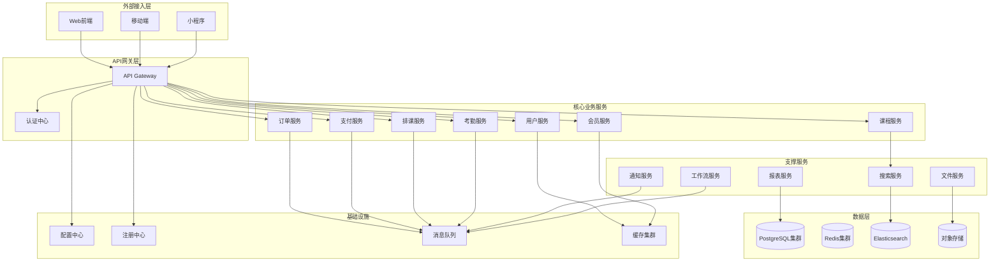
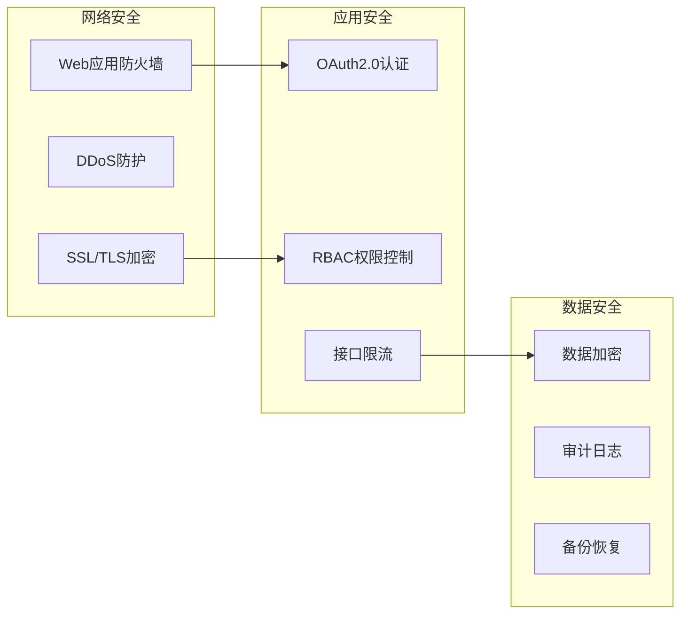
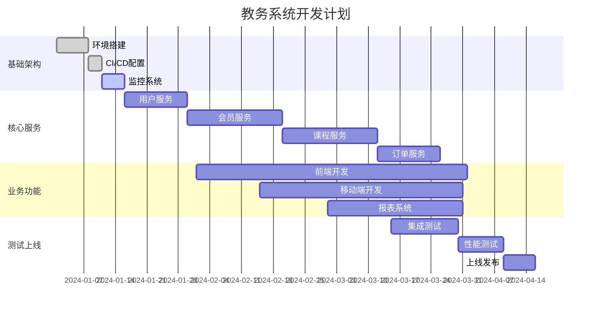

# 现代教务系统架构设计

## 1. 系统概述

基于微服务架构的新一代教务管理系统，采用云原生设计，支持高并发、高可用、弹性扩展。

### 1.1 设计目标

- **高性能**: 支持万级并发，响应时间<200ms
- **高可用**: 99.99%可用性，故障自动恢复
- **易扩展**: 微服务架构，按需扩展
- **易维护**: 完善的监控、日志、追踪系统
- **安全性**: 多层安全防护，数据加密存储

## 2. 技术栈选型

### 2.1 后端技术栈

| 类别 | 技术选型 | 说明 |
|------|----------|------|
| **开发框架** | Spring Boot 3.2 + Spring Cloud 2023 | 成熟的微服务生态 |
| **数据库** | PostgreSQL 15 + Redis 7.0 | 主关系型DB + 缓存 |
| **ORM** | MyBatis-Plus 3.5 + JPA | 灵活的数据访问 |
| **消息队列** | Apache Kafka 3.6 | 事件驱动架构 |
| **搜索引擎** | Elasticsearch 8.11 | 全文检索 |
| **认证授权** | Spring Security + JWT + OAuth2 | 安全认证 |
| **API网关** | Spring Cloud Gateway | 统一入口 |
| **配置中心** | Nacos 2.3 | 动态配置管理 |
| **服务注册** | Nacos Discovery | 服务治理 |
| **分布式事务** | Seata 1.7 | 分布式事务管理 |
| **监控** | Prometheus + Grafana + SkyWalking | 全链路监控 |

### 2.2 前端技术栈

| 类别 | 技术选型 | 说明 |
|------|----------|------|
| **框架** | Vue 3.4 + TypeScript | 现代前端框架 |
| **构建工具** | Vite 5.0 | 快速构建 |
| **UI框架** | Element Plus / Ant Design Vue | 企业级UI组件 |
| **状态管理** | Pinia 2.1 | 响应式状态管理 |
| **路由** | Vue Router 4.2 | 单页应用路由 |
| **HTTP客户端** | Axios 1.6 | API请求 |
| **图表** | ECharts 5.4 | 数据可视化 |
| **移动端** | Uni-app / Taro | 跨平台移动开发 |

### 2.3 基础设施

| 类别 | 技术选型 | 说明 |
|------|----------|------|
| **容器化** | Docker + Kubernetes | 容器编排 |
| **CI/CD** | GitLab CI + ArgoCD | 自动化部署 |
| **API文档** | Swagger/OpenAPI 3.0 + Knife4j | API文档 |
| **日志** | ELK Stack (Elasticsearch + Logstash + Kibana) | 日志管理 |
| **文件存储** | MinIO / 阿里云OSS | 对象存储 |
| **CDN** | CloudFlare / 阿里云CDN | 静态资源加速 |

## 3. 微服务模块设计

### 3.1 服务架构图



### 3.2 核心服务详情

#### 3.2.1 用户服务 (User Service)
```yaml
端口: 8001
职责:
  - 用户认证与授权
  - 权限管理
  - 组织架构管理
  - 操作日志
数据库: user_db
缓存: Redis (用户会话、权限信息)
```

#### 3.2.2 会员服务 (Member Service)
```yaml
端口: 8002
职责:
  - 会员信息管理
  - 会员卡管理
  - 会员等级
  - 积分管理
数据库: member_db
缓存: Redis (会员信息、积分)
```

#### 3.2.3 课程服务 (Course Service)
```yaml
端口: 8003
职责:
  - 课程管理
  - 课程分类
  - 课程评价
  - 学习进度
数据库: course_db
搜索: Elasticsearch
```

#### 3.2.4 订单服务 (Order Service)
```yaml
端口: 8004
职责:
  - 订单管理
  - 合同管理
  - 退费处理
  - 发票管理
数据库: order_db
事务: Seata (分布式事务)
```

#### 3.2.5 支付服务 (Payment Service)
```yaml
端口: 8005
职责:
  - 支付接口集成
  - 财务流水
  - 退款处理
  - 对账管理
数据库: payment_db
安全: 支付加密、签名验证
```

## 4. 数据库设计

### 4.1 数据库分片策略

```yaml
# 按业务域垂直拆分
数据库集群:
  user_db: 用户相关表
  member_db: 会员相关表
  course_db: 课程相关表
  order_db: 订单相关表
  payment_db: 支付相关表
  schedule_db: 排课相关表
  log_db: 日志相关表

# 大表水平拆分
member_follow: 按member_id哈希分片(16个分片)
order_master: 按年月分表
payment_flow: 按日分表
```

### 4.2 缓存策略

```yaml
缓存设计:
  L1缓存(本地): Caffeine
    - 配置信息
    - 字典数据
    - 用户权限(5分钟)

  L2缓存(分布式): Redis
    - 用户会话(30分钟)
    - 会员信息(10分钟)
    - 课程信息(1小时)
    - 热点查询(5分钟)

缓存更新策略:
  - Write-Through: 配置数据
  - Write-Behind: 统计数据
  - Cache-Aside: 业务数据
```

## 5. 安全设计

### 5.1 安全架构



### 5.2 安全措施

1. **认证授权**
   - OAuth2.0 + JWT
   - 多因素认证(MFA)
   - 单点登录(SSO)

2. **数据保护**
   - 敏感数据AES-256加密
   - 传输层TLS 1.3
   - 数据脱敏展示

3. **接口安全**
   - API签名验证
   - 请求限流(Rate Limiting)
   - 参数校验和SQL注入防护

4. **运维安全**
   - 操作审计
   - 权限最小化原则
   - 定期安全扫描

## 6. 性能优化策略

### 6.1 数据库优化

```sql
-- 分区表示例
CREATE TABLE payment_flow (
    id BIGSERIAL,
    payment_no VARCHAR(64),
    amount DECIMAL(12,2),
    create_time TIMESTAMP,
    ...
) PARTITION BY RANGE (create_time);

-- 索引优化
CREATE INDEX CONCURRENTLY idx_member_mobile
ON member(mobile) WHERE mobile IS NOT NULL;

-- 部分索引
CREATE INDEX idx_active_member
ON member(create_time)
WHERE status = 1;
```

### 6.2 应用层优化

```java
// 异步处理
@Async
@Service
public class NotificationService {
    public void sendNotification(Message message) {
        // 异步发送通知
    }
}

// 批量操作
@Transactional
public void batchUpdate(List<Member> members) {
    // 使用批量更新
}

// 缓存预热
@PostConstruct
public void warmUpCache() {
    // 预加载热点数据
}
```

### 6.3 架构优化

- CDN加速静态资源
- 数据库读写分离
- 查询优化和慢SQL监控
- JVM调优和GC优化

## 7. 监控与运维

### 7.1 监控体系

```yaml
监控指标:
  基础设施:
    - CPU、内存、磁盘、网络
    - 容器资源使用率

  应用监控:
    - QPS、响应时间、错误率
    - JVM指标、线程池
    - 业务指标统计

  数据库监控:
    - 连接数、慢查询
    - 锁等待、死锁
    - 主从延迟

日志管理:
  - 业务日志: 记录关键业务操作
  - 错误日志: 记录异常信息
  - 审计日志: 记录敏感操作
  - 性能日志: 记录慢请求
```

### 7.2 告警策略

```yaml
告警规则:
  P0-紧急:
    - 服务不可用
    - 错误率 > 5%
    - 响应时间 > 2s

  P1-重要:
    - CPU > 80%
    - 内存 > 90%
    - 磁盘 > 85%

  P2-一般:
    - QPS下降 > 20%
    - 缓存命中率 < 80%
    - 数据库连接数 > 80%
```

## 8. 部署架构

### 8.1 K8s部署方案

```yaml
# 命名空间隔离
apiVersion: v1
kind: Namespace
metadata:
  name: edu-prod
---
# 服务部署示例
apiVersion: apps/v1
kind: Deployment
metadata:
  name: member-service
  namespace: edu-prod
spec:
  replicas: 3
  strategy:
    type: RollingUpdate
  template:
    spec:
      containers:
      - name: member-service
        image: edu/member-service:v1.0.0
        resources:
          limits:
            cpu: 1000m
            memory: 2Gi
          requests:
            cpu: 500m
            memory: 1Gi
        livenessProbe:
          httpGet:
            path: /actuator/health
            port: 8002
          initialDelaySeconds: 60
        readinessProbe:
          httpGet:
            path: /actuator/health/readiness
            port: 8002
```

### 8.2 环境规划

| 环境 | 用途 | 配置 |
|------|------|------|
| dev | 开发环境 | 单节点，基础配置 |
| test | 测试环境 | 2节点，模拟生产 |
| staging | 预发布环境 | 生产同等配置 |
| prod | 生产环境 | 高可用，自动扩缩容 |

## 9. 开发规范

### 9.1 代码规范

```java
// 统一响应格式
@Data
@AllArgsConstructor
public class Result<T> {
    private Integer code;
    private String message;
    private T data;
    private Long timestamp;
}

// 统一异常处理
@RestControllerAdvice
public class GlobalExceptionHandler {
    @ExceptionHandler(BusinessException.class)
    public Result<Void> handleBusinessException(BusinessException e) {
        return Result.error(e.getCode(), e.getMessage());
    }
}
```

### 9.2 API规范

```yaml
# RESTful API设计
GET    /api/v1/members         # 查询会员列表
GET    /api/v1/members/{id}    # 查询会员详情
POST   /api/v1/members         # 创建会员
PUT    /api/v1/members/{id}    # 更新会员
DELETE /api/v1/members/{id}    # 删除会员

# 统一响应
{
  "code": 200,
  "message": "success",
  "data": {},
  "timestamp": 1703123456789
}
```

## 10. 项目计划

### 10.1 实施阶段



### 10.2 团队配置

- 架构师: 1人（负责整体架构设计）
- 后端开发: 4人（每人负责2-3个微服务）
- 前端开发: 2人（Web端+移动端）
- 测试工程师: 2人（功能测试+性能测试）
- 运维工程师: 1人（负责部署和监控）
- 产品经理: 1人（需求管理和进度协调）

## 11. 预期收益

### 11.1 性能提升

- 响应时间：从500ms降至100ms以内
- 并发能力：支持10倍并发用户
- 可用性：从99%提升到99.99%

### 11.2 开发效率

- 微服务独立开发部署
- 容器化一键发布
- 完善的监控告警体系
- 自动化测试和部署

### 11.3 运维成本

- 资源按需分配，节省30%成本
- 自动化运维，减少人力投入
- 容器化部署，提高资源利用率
- 监控预警，快速定位问题

这个现代化的教务系统架构设计充分利用了云原生技术的优势，能够满足未来5-10年的业务发展需求。