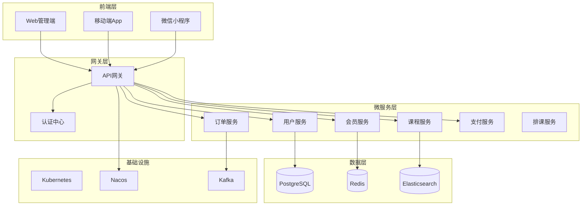

# 现代教务系统

> 基于云原生微服务架构的新一代教务管理系统，支持高并发、高可用、弹性扩展

## 项目概述

本项目是一个现代化的教务管理系统，采用 Spring Cloud 微服务架构 + Vue3 前端的技术栈，旨在替换运行了十年的老旧教务系统，提供更好的性能、可扩展性和用户体验。

### 核心特性

- 🚀 **高性能**: 支持10倍并发，响应时间<200ms
- 🏗️ **微服务架构**: 服务独立部署，按需扩展
- 📱 **全端覆盖**: Web端 + 移动端 + 小程序
- 🔒 **安全可靠**: 多层安全防护，数据加密存储
- 📊 **智能分析**: 实时数据统计，可视化报表
- 🎯 **易于维护**: 完善的监控日志，自动化部署

## 技术架构

### 后端技术栈

| 技术 | 版本 | 说明 |
|------|------|------|
| Spring Boot | 3.2.0 | 微服务基础框架 |
| Spring Cloud | 2023.0.0 | 微服务治理 |
| PostgreSQL | 15.0 | 主数据库 |
| Redis | 7.0 | 缓存中间件 |
| Kafka | 3.6.0 | 消息队列 |
| Elasticsearch | 8.11 | 搜索引擎 |
| Nacos | 2.3.0 | 服务注册发现 |
| Seata | 1.7.0 | 分布式事务 |

### 前端技术栈

| 技术 | 版本 | 说明 |
|------|------|------|
| Vue | 3.4.0 | 前端框架 |
| TypeScript | 5.3.0 | 类型系统 |
| Element Plus | 2.5.0 | UI组件库 |
| Vite | 5.0.0 | 构建工具 |
| Pinia | 2.1.0 | 状态管理 |
| ECharts | 5.4.0 | 数据可视化 |

## 系统架构图



## 快速开始

### 环境要求

- JDK 17+
- Node.js 18+
- Docker & Docker Compose
- PostgreSQL 15+
- Redis 7+

### 本地开发

1. **克隆项目**
```bash
git clone https://github.com/edu/modern-education-system.git
cd modern-education-system
```

2. **启动基础服务**
```bash
# 启动 Nacos
docker run -d --name nacos -p 8848:8848 \
  -e MODE=standalone \
  nacos/nacos-server:v2.3.0

# 启动 PostgreSQL
docker run -d --name postgres \
  -e POSTGRES_DB=edu_system \
  -e POSTGRES_USER=edu \
  -e POSTGRES_PASSWORD=edu123456 \
  -p 5432:5432 \
  postgres:15-alpine

# 启动 Redis
docker run -d --name redis -p 6379:6379 redis:7-alpine
```

3. **初始化数据库**
```bash
# 执行SQL脚本
psql -h localhost -U edu -d edu_system -f database/init.sql
```

4. **启动后端服务**
```bash
# 启动用户服务
cd user-service
mvn spring-boot:run

# 启动会员服务
cd ../member-service
mvn spring-boot:run

# 启动其他服务...
```

5. **启动前端**
```bash
cd frontend
npm install
npm run dev
```

6. **访问系统**
- 前端地址: http://localhost:3000
- API网关: http://localhost:8000
- Nacos控制台: http://localhost:8848/nacos

默认账号: admin / admin123

## 项目结构

```
modern-education-system/
├── backend/                    # 后端服务
│   ├── user-service/          # 用户服务
│   ├── member-service/        # 会员服务
│   ├── course-service/        # 课程服务
│   ├── order-service/         # 订单服务
│   ├── payment-service/       # 支付服务
│   ├── schedule-service/      # 排课服务
│   ├── gateway/               # API网关
│   └── common/                # 公共模块
├── frontend/                  # 前端项目
│   ├── admin/                 # Web管理端
│   ├── mobile/                # 移动端
│   └── miniprogram/           # 小程序
├── database/                  # 数据库脚本
├── deployment/                # 部署配置
│   ├── docker/                # Docker配置
│   ├── kubernetes/            # K8s配置
│   └── ci/                    # CI/CD配置
├── docs/                      # 项目文档
│   ├── api/                   # API文档
│   ├── design/                # 设计文档
│   └── deployment/            # 部署文档
├── samples/                   # 代码示例
└── scripts/                   # 工具脚本
```

## 核心功能模块

### 1. 会员管理
- 会员信息管理
- 会员卡管理
- 积分系统
- 会员标签

### 2. 课程管理
- 课程信息管理
- 教师管理
- 教室管理
- 课程评价

### 3. 订单管理
- 订单创建和管理
- 合同管理
- 退费处理
- 财务报表

### 4. 教学管理
- 排课系统
- 考勤管理
- 作业管理
- 成绩管理

### 5. 支付管理
- 多渠道支付
- 自动对账
- 退款管理
- 财务统计

## API文档

访问 [Swagger文档](http://localhost:8000/swagger-ui.html) 查看完整的API文档。

## 部署指南

### Docker部署

```bash
# 构建镜像
docker-compose build

# 启动所有服务
docker-compose up -d

# 查看服务状态
docker-compose ps
```

### Kubernetes部署

```bash
# 创建命名空间
kubectl create namespace edu-system

# 部署服务
kubectl apply -f deployment/kubernetes/
```

详细部署说明请参考 [部署文档](docs/deployment/部署指南.md)

## 开发指南

### 后端开发规范

1. **代码规范**: 遵循阿里巴巴Java开发手册
2. **Git规范**: 使用Conventional Commits
3. **单元测试**: 覆盖率不低于80%
4. **API文档**: 使用Swagger生成

### 前端开发规范

1. **组件命名**: 使用PascalCase
2. **文件命名**: 使用kebab-case
3. **代码风格**: 使用ESLint + Prettier
4. **提交规范**: 使用Commitizen

## 监控告警

### 系统监控

- **应用监控**: Spring Boot Actuator + Micrometer
- **链路追踪**: SkyWalking
- **日志聚合**: ELK Stack
- **指标监控**: Prometheus + Grafana

### 告警规则

- 服务不可用
- 响应时间 > 2s
- 错误率 > 5%
- CPU使用率 > 80%

## 性能测试

使用 JMeter 进行压力测试：

```bash
# 运行测试脚本
jmeter -n -t test-plan.jmx -l results.jtl
```

## 常见问题

### Q: 如何新增一个微服务？

1. 在 `backend` 目录下创建新的服务模块
2. 继承 `common` 模块的依赖
3. 配置 Nacos 服务注册
4. 添加到 API 网关路由

### Q: 如何配置数据库读写分离？

参考 `common/starter` 中的 `DataSourceAutoConfiguration` 配置。

### Q: 如何处理分布式事务？

使用 Seata AT 模式，在需要事务的方法上添加 `@GlobalTransactional` 注解。

## 贡献指南

欢迎贡献代码！请遵循以下步骤：

1. Fork 项目
2. 创建特性分支 (`git checkout -b feature/AmazingFeature`)
3. 提交更改 (`git commit -m 'Add some AmazingFeature'`)
4. 推送到分支 (`git push origin feature/AmazingFeature`)
5. 创建 Pull Request

## 许可证

本项目采用 MIT 许可证 - 查看 [LICENSE](LICENSE) 文件了解详情。

## 联系我们

- 项目维护者: [EDU Team](mailto:team@edu.com)
- 问题反馈: [GitHub Issues](https://github.com/edu/modern-education-system/issues)
- 技术交流: [微信群二维码](docs/images/wechat-group.jpg)

## 致谢

感谢所有为这个项目做出贡献的开发者！

---

⭐ 如果这个项目对您有帮助，请给我们一个 Star！