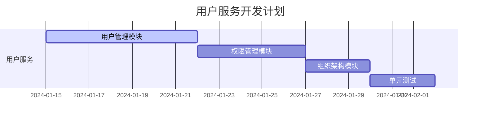
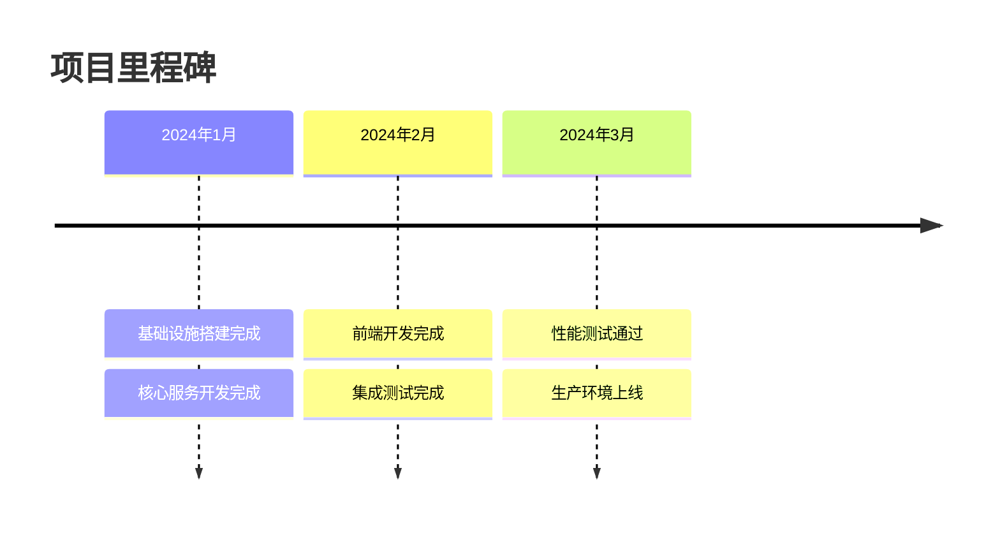

# 现代教务系统实施计划

## 1. 项目概述

### 1.1 项目背景

- 现有系统运行10年，技术架构老旧，性能瓶颈明显
- 使用MySQL 5.0 + MyISAM，无法支持高并发和事务
- 缺乏现代化监控和运维体系
- 业务扩展困难，维护成本高

### 1.2 项目目标

- **性能提升**: 支持10倍并发，响应时间<200ms
- **技术升级**: 采用云原生微服务架构
- **功能完善**: 增加移动端、小程序、数据分析等功能
- **运维优化**: 实现自动化部署和智能监控

### 1.3 项目范围

| 模块 | 内容 | 优先级 |
|------|------|--------|
| 核心业务 | 会员管理、课程管理、订单管理 | P0 |
| 教学管理 | 排课、考勤、评价 | P0 |
| 支付财务 | 支付、退款、财务报表 | P1 |
| 移动应用 | 手机App、小程序 | P1 |
| 数据分析 | 报表系统、数据大屏 | P2 |
| 智能功能 | AI推荐、智能排课 | P3 |

## 2. 项目团队

### 2.1 团队构成

| 角色 | 人数 | 主要职责 |
|------|------|----------|
| 项目经理 | 1 | 项目管理、进度跟踪、风险控制 |
| 架构师 | 1 | 技术架构设计、技术难点攻关 |
| 后端开发 | 4 | 微服务开发、API实现 |
| 前端开发 | 2 | Web端、移动端开发 |
| 测试工程师 | 2 | 功能测试、性能测试 |
| 运维工程师 | 1 | 环境搭建、部署、监控 |
| 产品经理 | 1 | 需求管理、产品设计 |
| UI设计师 | 1 | 界面设计、交互设计 |

### 2.2 技能要求

- 后端：Spring Cloud、PostgreSQL、Redis、Kafka
- 前端：Vue3、TypeScript、Uni-app
- 运维：Kubernetes、Docker、CI/CD
- 测试：自动化测试、性能测试工具

## 3. 项目阶段

### 3.1 第一阶段：基础设施搭建（2周）

#### 3.1.1 环境准备
- [x] 开发环境搭建
- [ ] 测试环境搭建
- [ ] 生产环境规划
- [ ] CI/CD流水线配置

#### 3.1.2 技术选型确认
- [ ] 微服务框架定版
- [ ] 数据库选型
- [ ] 缓存方案
- [ ] 消息队列选型

#### 3.1.3 交付物
- 《技术架构方案》
- 《环境配置文档》
- 《开发规范》

### 3.2 第二阶段：核心服务开发（8周）

#### 3.2.1 用户服务（2周）


**开发任务**:
- 用户注册、登录、信息管理
- RBAC权限控制
- JWT认证
- 操作日志

**验收标准**:
- 用户注册登录流程完整
- 权限控制精准
- 单元测试覆盖率>80%

#### 3.2.2 会员服务（2周）
**开发任务**:
- 会员信息管理
- 会员卡管理
- 积分系统
- 会员标签

**核心功能**:
```java
@Service
@Transactional
public class MemberService {

    // 创建会员
    public MemberDTO createMember(CreateMemberCommand cmd) {
        // 1. 验证手机号唯一性
        // 2. 创建会员记录
        // 3. 发送欢迎消息
        // 4. 记录操作日志
    }

    // 发放会员卡
    public CardDTO issueCard(IssueCardCommand cmd) {
        // 1. 验证会员状态
        // 2. 检查卡类型
        // 3. 生成卡号
        // 4. 扣减库存
    }
}
```

#### 3.2.3 课程服务（2周）
**开发任务**:
- 课程管理
- 教师管理
- 教室管理
- 课程评价

**技术要点**:
- 使用Elasticsearch实现课程搜索
- Redis缓存热门课程
- 图片使用OSS存储

#### 3.2.4 订单服务（2周）
**开发任务**:
- 订单管理
- 合同管理
- 退费流程
- 库存管理

**分布式事务处理**:
```java
@GlobalTransactional
public OrderDTO createOrder(CreateOrderCommand cmd) {
    // 1. 创建订单
    Order order = orderRepository.save(cmd);

    // 2. 扣减库存
    productService.reduceStock(cmd.getItems());

    // 3. 锁定会员卡
    cardService.lockCard(cmd.getCardId());

    return orderMapper.toDTO(order);
}
```

### 3.3 第三阶段：前端开发（6周）

#### 3.3.1 Web端开发（4周）
```typescript
// 技术栈配置
// package.json
{
  "dependencies": {
    "vue": "^3.4.0",
    "vue-router": "^4.2.0",
    "pinia": "^2.1.0",
    "element-plus": "^2.5.0",
    "axios": "^1.6.0",
    "echarts": "^5.4.0",
    "typescript": "^5.3.0"
  }
}
```

**页面模块**:
- 登录首页
- 会员管理
- 课程管理
- 订单中心
- 数据报表

#### 3.3.2 移动端开发（2周）
**技术选择**: Uni-app + Vue3

```vue
<!-- 会员详情页示例 -->
<template>
  <view class="member-detail">
    <view class="header">
      <image :src="member.avatar" mode="aspectFill" />
      <text class="name">{{ member.name }}</text>
      <text class="level">{{ member.level }}</text>
    </view>

    <view class="cards">
      <card-item
        v-for="card in memberCards"
        :key="card.id"
        :card="card"
        @click="viewCardDetail"
      />
    </view>
  </view>
</template>
```

### 3.4 第四阶段：集成测试（2周）

#### 3.4.1 测试计划
```yaml
测试类型:
  单元测试:
    覆盖率要求: >80%
    工具: JUnit5 + Mockito

  集成测试:
    API接口测试
    数据库集成测试
    第三方服务集成测试

  性能测试:
    并发用户: 1000
    响应时间: <200ms
    工具: JMeter + Gatling

  安全测试:
    SQL注入防护
    XSS攻击防护
    权限越权测试
```

#### 3.4.2 测试用例
| 模块 | 功能 | 测试点 | 预期结果 |
|------|------|--------|----------|
| 会员管理 | 会员注册 | 手机号唯一性 | 不允许重复注册 |
| 课程管理 | 课程发布 | 价格格式验证 | 支持两位小数 |
| 订单管理 | 订单支付 | 金额准确性 | 金额计算无误 |
| 考勤管理 | 签到功能 | 时间校验 | 仅允许上课前后30分钟 |

### 3.5 第五阶段：部署上线（1周）

#### 3.5.1 部署清单
```yaml
生产环境:
  服务器:
    - 应用服务器: 4核8G x 3台
    - 数据库服务器: 16核32G x 2台(主从)
    - Redis服务器: 8核16G x 3台(集群)
    - 负载均衡: 2台

  网络配置:
    - 域名: edu.example.com
    - SSL证书: 已配置
    - CDN: 已配置
    - 防火墙: 已配置
```

#### 3.5.2 上线步骤
1. **数据迁移**
   - 导出旧系统数据
   - 数据清洗和转换
   - 导入新系统
   - 数据校验

2. **灰度发布**
   - 10%流量切换
   - 监控系统指标
   - 问题修复
   - 逐步扩大流量

3. **全量上线**
   - 100%流量切换
   - 旧系统下线
   - 数据备份
   - 监控告警

## 4. 项目里程碑



## 5. 风险管理

### 5.1 技术风险

| 风险项 | 概率 | 影响 | 应对措施 |
|--------|------|------|----------|
| 微服务复杂度高 | 中 | 高 | 充分的技术调研、PoC验证 |
| 数据迁移失败 | 中 | 高 | 制定详细迁移方案、多次演练 |
| 性能不达标 | 低 | 高 | 提前进行性能测试、优化 |
| 第三方服务不稳定 | 中 | 中 | 准备备用方案、降级策略 |

### 5.2 项目风险

| 风险项 | 概率 | 影响 | 应对措施 |
|--------|------|------|----------|
| 需求变更频繁 | 高 | 中 | 敏捷开发、迭代交付 |
| 人员变动 | 中 | 中 | 知识共享、文档完善 |
| 进度延期 | 中 | 高 | 合理安排资源、关键路径管理 |
| 预算超支 | 低 | 中 | 成本控制、定期审计 |

## 6. 质量保障

### 6.1 代码质量

```yaml
代码规范:
  编码规范: 阿里巴巴Java开发手册
  命名规范: 统一的命名约定
  注释规范: 关键逻辑必须有注释

代码审查:
  每个PR必须经过审查
  审查者至少1人
  审查通过才能合并

自动化检查:
  代码格式检查: Checkstyle
  静态代码分析: SonarQube
  安全扫描: SpotBugs
```

### 6.2 文档管理

```yaml
必需文档:
  技术设计文档
  API接口文档
  数据库设计文档
  部署运维文档
  用户操作手册

更新要求:
  随代码同步更新
  版本控制管理
  定期review
```

## 7. 项目预算

| 类别 | 金额（万元） | 说明 |
|------|--------------|------|
| 人力成本 | 280 | 14人 x 5个月 x 4万/月 |
| 硬件成本 | 60 | 服务器、存储、网络设备 |
| 软件许可 | 20 | 数据库、中间件、监控工具 |
| 第三方服务 | 15 | 云服务、短信、支付通道 |
| 其他费用 | 25 | 培训、差旅、应急储备 |
| **总计** | **400** | |

## 8. 成功标准

### 8.1 技术指标
- 系统可用性 ≥ 99.99%
- 平均响应时间 < 200ms
- 支持1000+并发用户
- 代码测试覆盖率 ≥ 80%

### 8.2 业务指标
- 会员转化率提升 20%
- 运营效率提升 50%
- 系统故障率降低 80%
- 用户满意度 ≥ 95%

### 8.3 交付成果
- 完整的教务管理系统
- 移动端应用
- 管理后台
- 数据报表系统
- 完整的项目文档

## 9. 后续优化计划

### 9.1 短期优化（3个月）
- 收集用户反馈，优化用户体验
- 修复系统bug，提升稳定性
- 完善监控告警体系

### 9.2 中期优化（6个月）
- 引入AI推荐算法
- 增加在线直播功能
- 开发家校互动模块

### 9.3 长期规划（1年）
- 大数据分析平台
- 智能排课系统
- 多校区管理

## 10. 总结

本项目通过采用现代化的技术架构和科学的项目管理方法，旨在打造一个高性能、高可用、易扩展的教务管理系统。项目周期5个月，总预算400万元，预期将显著提升教务管理效率，为机构的数字化转型提供有力支撑。

项目成功的关键在于：
1. 合理的技术选型和架构设计
2. 严格的项目管理和质量控制
3. 充分的测试和灰度发布
4. 完善的监控和运维体系

通过本项目的实施，将彻底解决现有系统的性能瓶颈和架构问题，为未来5-10年的业务发展奠定坚实的技术基础。