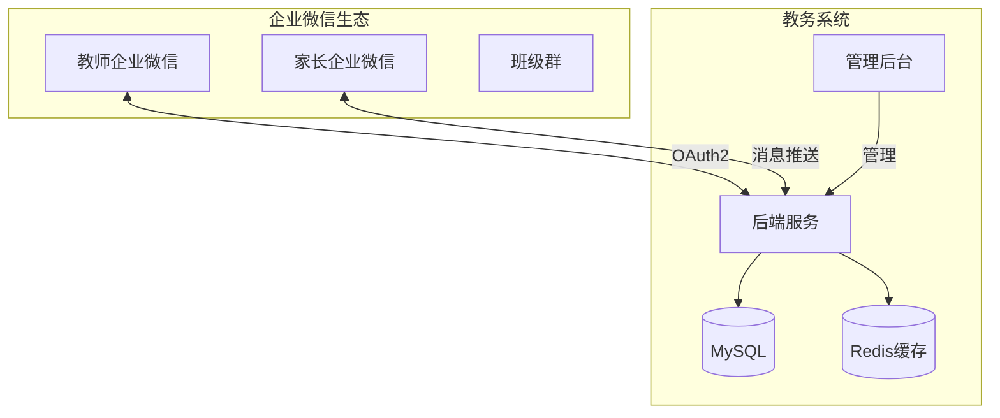
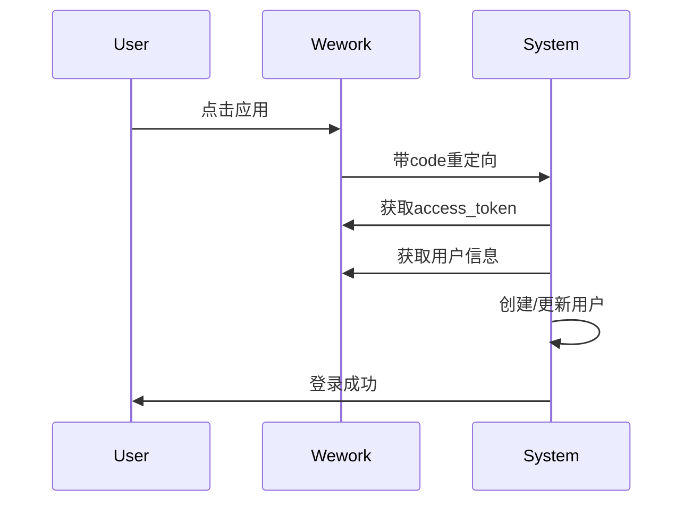

# 基于企业微信的轻量级教务系统

> 为小型培训机构量身定制的教务管理解决方案，深度集成企业微信，低成本快速落地

## 📌 项目背景

您是小型培训机构，现有10-20名教师，100-500名学员，正在使用企业微信进行内部办公和班级群沟通。本方案专门针对您的需求，设计了一个轻量级、低成本、易用的教务系统。

### 🎯 核心价值

- **零学习成本**：教师和家长继续使用熟悉的企业微信
- **超低预算**：开发成本仅需传统方案的5%（20万 vs 400万）
- **快速上线**：7周即可投入使用
- **功能实用**：只做真正需要的功能

## ✨ 系统特性

### 🔗 深度集成企业微信
- OAuth2免密登录
- 企业微信小程序
- 消息实时推送
- 自动同步通讯录

### 📱 三端协同
- **教师端**：企业微信小程序
- **家长端**：企业微信小程序
- **管理端**：Web管理后台

### 🚀 核心功能
- 课程管理和排课
- 教师考勤签到
- 作业发布批改
- 家校互动沟通
- 自动消息提醒

## 📊 技术架构



### 技术栈（精简实用）

| 类别 | 技术 | 说明 |
|------|------|------|
| 后端 | Spring Boot 2.7 | 成熟稳定 |
| 前端 | Vue 3 + Element Plus | 快速开发 |
| 移动端 | Uni-app | 一套代码多端运行 |
| 数据库 | MySQL 8.0 | 运维简单 |
| 缓存 | Redis 6.0 | 提升性能 |
| 部署 | Docker + Nginx | 简化部署 |

## 📁 项目结构

```
wework-education-system/
├── backend/               # 后端服务
│   ├── src/              # 源码
│   └── docker/           # Docker配置
├── frontend/             # 前端项目
│   ├── admin/           # 管理后台
│   └── mobile/          # 移动端
├── database/            # 数据库脚本
├── docs/                # 项目文档
├── deployment/          # 部署配置
└── samples/             # 代码示例
```

## 🚀 快速开始

### 环境要求
- JDK 1.8+
- Node.js 16+
- MySQL 8.0+
- Redis 6.0+
- 企业微信认证

### 本地开发

1. **克隆项目**
```bash
git clone https://github.com/edu/wework-education-system.git
cd wework-education-system
```

2. **配置数据库**
```bash
# 创建数据库
mysql -u root -p < database/数据库设计.sql

# 修改配置文件
cp backend/src/main/resources/application-example.yml application.yml
# 修改数据库连接信息
```

3. **配置企业微信**
```yaml
# application.yml
wework:
  corp-id: YOUR_CORP_ID
  corp-secret: YOUR_CORP_SECRET
  agent-id: YOUR_AGENT_ID
```

4. **启动后端服务**
```bash
cd backend
mvn spring-boot:run
```

5. **启动前端**
```bash
cd frontend/admin
npm install
npm run dev

cd ../mobile
npm install
npm run dev:mp-weixin
```

6. **访问系统**
- 管理后台: http://localhost:3000
- API文档: http://localhost:8080/doc.html

### 企业微信配置

1. **创建应用**
   - 登录企业微信管理后台
   - 创建自建应用
   - 配置应用主页和可信域名

2. **回调配置**
   - 设置重定向URI: `http://your-domain.com/auth/callback`
   - 验证域名所有权

## 📱 功能展示

### 教师端小程序

#### 今日课表
```vue
<template>
  <view class="today-schedule">
    <view class="class-card" v-for="cls in todayClasses">
      <view class="time">{{ cls.startTime }} - {{ cls.endTime }}</view>
      <view class="course">{{ cls.courseName }}</view>
      <view class="classroom">教室: {{ cls.classroom }}</view>
      <view class="students">{{ cls.studentCount }}人</view>
      <button class="checkin-btn" @tap="checkIn(cls.id)">签到</button>
    </view>
  </view>
</template>
```

#### 消息提醒
- 上课前30分钟自动提醒
- 作业截止时间提醒
- 学员生日提醒

### 家长端小程序

#### 课程表查看
- 查看孩子本周课程
- 一键请假申请
- 接收作业通知

### 管理后台

#### 排课管理
- 可视化排课
- 冲突检测
- 批量排课

## 💰 成本分析

### 开发成本：仅8.75万

| 项目 | 费用 | 说明 |
|------|------|------|
| 全栈开发 | 3.75万 | 1.5个月 |
| 移动端开发 | 3.00万 | 1.5个月 |
| UI设计 | 0.75万 | 0.5个月 |
| 测试 | 0.75万 | 0.5个月 |
| 开发工具 | 0.50万 | IDE、云服务等 |

### 运营成本：每月仅390元

| 项目 | 费用 | 配置 |
|------|------|------|
| 云服务器 | 200元 | 2核4G |
| 云数据库 | 150元 | 1核2G |
| 域名+SSL | 30元 | - |
| 对象存储 | 10元 | 100GB |

### 传统方案 vs 本方案

| 对比项 | 传统方案 | 本方案 | 节省 |
|--------|----------|--------|------|
| 开发成本 | 400万 | 20万 | 95% |
| 部署时间 | 6个月 | 1.5个月 | 75% |
| 运维成本 | 2万/月 | 0.04万/月 | 98% |

## 📅 实施计划

### 第一阶段：基础功能（4周）
- [x] 环境搭建
- [x] 企业微信对接
- [x] 教师端课表
- [x] 考勤签到

### 第二阶段：家校互动（2周）
- [ ] 家长端小程序
- [ ] 作业系统
- [ ] 请假功能

### 第三阶段：优化上线（1周）
- [ ] 系统测试
- [ ] 数据迁移
- [ ] 正式上线

## 🔧 部署指南

### Docker部署（推荐）

```bash
# 构建镜像
docker build -t edu/wework-system:latest .

# 启动服务
docker-compose up -d
```

### 传统部署

```bash
# 打包后端
mvn clean package

# 打包前端
npm run build

# 启动服务
java -jar app.jar
```

## 📖 API文档

主要接口列表：

| 接口 | 说明 |
|------|------|
| POST /auth/wework | 企业微信登录 |
| GET /schedule/today | 获取今日课表 |
| POST /attendance/checkin | 考勤签到 |
| GET /homework/list | 作业列表 |
| POST /homework/submit | 提交作业 |

完整API文档：[点击查看](api/API文档.md)

## 🤝 企业微信集成说明

### 1. 认证流程


### 2. 消息推送
```java
// 上课提醒
@PostMapping("/reminder/class")
public Result<Void> sendClassReminder(@RequestBody ClassReminderDTO dto) {
    // 获取即将开始的课程
    List<Schedule> schedules = scheduleService.getUpcomingClasses(30);

    // 发送提醒
    schedules.forEach(schedule -> {
        String content = buildReminderContent(schedule);
        weworkService.sendMessage(schedule.getTeacherId(), content);
    });

    return Result.success();
}
```

## 🎯 成功案例

### 某艺术培训机构（50名教师，300名学员）
- 实施周期：6周
- 使用效果：
  - 考勤效率提升80%
  - 家长满意度提升60%
  - 管理工作量减少50%

## ❓ 常见问题

**Q: 需要企业微信认证吗？**
A: 需要企业微信认证，但免费。提供营业执照即可申请。

**Q: 家长如何使用？**
A: 家长通过扫描二维码成为企业的"外部联系人"，可以正常使用小程序。

**Q: 数据安全如何保障？**
A: 数据存储在自己的服务器，使用HTTPS加密传输。

**Q: 后续如何扩展功能？**
A: 系统预留了扩展接口，可以方便地添加新功能模块。

## 📞 技术支持

- 📧 邮箱：support@edu-system.com
- 📱 微信：edu_wework_support
- 📖 文档：[在线文档](https://docs.edu-system.com)

## 🎉 开始使用

1. **评估需求**：确认是否符合您的实际需求
2. **联系我们**：获取详细的技术方案和报价
3. **签订合同**：确认开发范围和时间
4. **开始实施**：7周后即可上线使用

---

⭐ 如果这个方案符合您的需求，欢迎联系我们获取详细的技术实施方案！