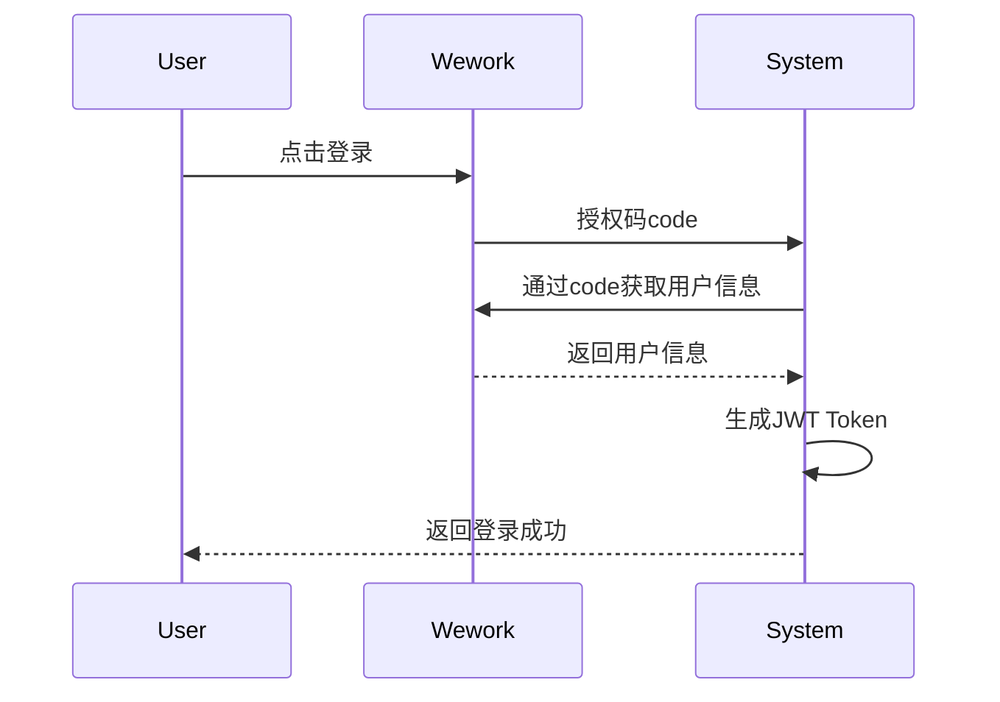
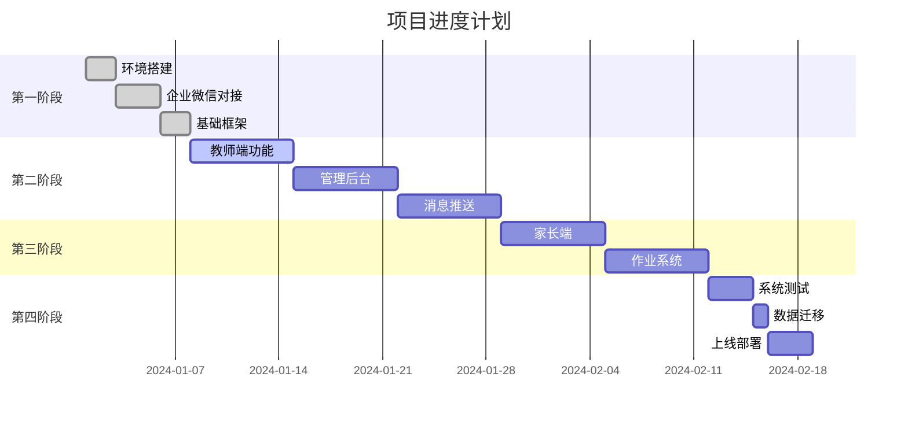

# 企业微信教务系统实施计划

## 1. 项目概述

### 1.1 项目目标
- 基于企业微信构建轻量级教务系统
- 实现教师端、家长端、管理端基本功能
- 预算控制在20万以内
- 7周快速上线

### 1.2 实施原则
- **快速迭代**：MVP优先，核心功能先行
- **成本可控**：使用成熟技术，降低开发难度
- **体验优先**：充分利用企业微信生态
- **逐步扩展**：预留扩展接口，支持后续功能

## 2. 团队配置

### 2.1 团队结构（精简版）

| 角色 | 人数 | 主要职责 | 月薪（万元） |
|------|------|----------|--------------|
| 全栈开发 | 1 | 后端+前端+企业微信对接 | 2.5 |
| 移动端开发 | 1 | 小程序+H5开发 | 2.0 |
| UI设计 | 0.5 | 界面设计 | 1.5 |
| 测试 | 0.5 | 功能测试 | 1.5 |
| **合计** | **3人** |  | **7.5万/月** |

### 2.2 技能要求
- 全栈：熟悉Spring Boot、Vue、企业微信API
- 移动端：熟悉Uni-app、小程序开发
- 团队沟通良好，有教育行业经验优先

## 3. 实施阶段

### 3.1 第一阶段：基础搭建（第1周）

#### 3.1.1 环境准备（2天）

```bash
# 服务器配置（阿里云）
CPU: 2核
内存: 4GB
系统: CentOS 7.9
带宽: 5Mbps

# 软件环境
- JDK 1.8
- MySQL 8.0
- Redis 6.0
- Nginx 1.18
- Docker 20.10
```

#### 3.1.2 企业微信对接（3天）

1. **企业微信配置**
   - 注册企业微信认证（免费）
   - 创建自建应用
   - 配置可信域名
   - 获取CorpID、Secret、AgentID

2. **后端框架搭建**
   - Spring Boot 2.7项目初始化
   - 企业微信SDK集成
   - OAuth2登录验证
   - API接口规范定义

3. **数据库初始化**
   - 创建数据库
   - 导入初始数据
   - 配置连接池

#### 3.1.3 交付物
- [x] 开发环境搭建完成
- [x] 企业微信认证打通
- [x] 基础框架搭建完成

### 3.2 第二阶段：核心功能（第2-4周）

#### 3.2.1 教师端功能（第2周）

**开发内容**：

1. **用户认证**
```java
// 企业微信OAuth2登录
@PostMapping("/auth/wework")
public Result<String> weworkAuth(@RequestParam String code) {
    // 1. 通过code获取用户信息
    WxUser user = weworkService.getUserInfo(code);

    // 2. 查询或创建用户
    User dbUser = userService.getOrCreateUser(user);

    // 3. 生成JWT Token
    String token = jwtService.generateToken(dbUser);

    return Result.success(token);
}
```

2. **今日课表**
```java
@GetMapping("/schedule/today")
public Result<List<ScheduleDTO>> getTodaySchedule() {
    String userId = SecurityContextHolder.getUserId();
    return Result.success(scheduleService.getTodaySchedule(userId));
}
```

3. **考勤签到**
```java
@PostMapping("/attendance/checkin")
public Result<Void> checkIn(@RequestBody CheckInDTO dto) {
    // 1. 验证课程时间
    Schedule schedule = scheduleService.getById(dto.getScheduleId());
    validateCheckInTime(schedule);

    // 2. 记录考勤
    attendanceService.checkIn(dto);

    // 3. 发送签到成功通知
    messageService.sendCheckInSuccess(schedule);

    return Result.success();
}
```

4. **企业微信小程序页面**
```vue
<!-- 教师端首页 -->
<template>
  <view class="home">
    <!-- 用户信息 -->
    <view class="user-header">
      <image :src="userInfo.avatar" />
      <text>{{ userInfo.name }}</text>
    </view>

    <!-- 快捷功能 -->
    <view class="quick-menu">
      <view class="menu-item" @tap="goToSchedule">
        <text class="icon">📅</text>
        <text>今日课表</text>
      </view>
      <view class="menu-item" @tap="goToCheckin">
        <text class="icon">✅</text>
        <text>考勤签到</text>
      </view>
      <view class="menu-item" @tap="goToHomework">
        <text class="icon">📝</text>
        <text>布置作业</text>
      </view>
    </view>

    <!-- 今日课程 -->
    <view class="today-classes">
      <view class="section-title">今日课程</view>
      <view
        v-for="item in todayClasses"
        :key="item.id"
        class="class-card"
        @tap="viewClassDetail(item)"
      >
        <view class="time">{{ item.startTime }} - {{ item.endTime }}</view>
        <view class="info">
          <text class="name">{{ item.courseName }}</text>
          <text class="classroom">{{ item.classroom }}</text>
        </view>
        <view class="students">{{ item.studentCount }}人</view>
      </view>
    </view>
  </view>
</template>
```

#### 3.2.2 管理后台（第3周）

**开发内容**：

1. **权限管理**
```java
// 基于角色的权限控制
@PreAuthorize("hasRole('ADMIN')")
@RestController
@RequestMapping("/api/admin")
public classAdminController {

    @GetMapping("/users")
    public Result<PageResult<User>> getUsers(@RequestParam Map<String, Object> params) {
        return Result.success(userService.getPage(params));
    }
}
```

2. **课程管理**
3. **班级管理**
4. **学员管理**
5. **排课管理**

#### 3.2.3 消息推送（第4周）

**开发内容**：

1. **定时任务配置**
```java
@Configuration
@EnableScheduling
public class ScheduleConfig {

    // 每5分钟检查一次上课提醒
    @Scheduled(fixedRate = 300000)
    public void checkClassReminder() {
        reminderService.sendClassReminders();
    }

    // 每天早上8点发送今日课程汇总
    @Scheduled(cron = "0 0 8 * * ?")
    public void sendDailySummary() {
        summaryService.sendDailySummary();
    }
}
```

2. **消息模板服务**
```java
@Service
public class MessageService {

    public void sendClassReminder(Schedule schedule) {
        // 获取消息模板
        MessageTemplate template = templateRepository.getByCode("CLASS_REMIND");

        // 替换变量
        String content = template.getContent()
            .replace("{{courseName}}", schedule.getCourseName())
            .replace("{{startTime}}", schedule.getStartTime())
            .replace("{{classroom}}", schedule.getClassroom());

        // 发送给教师
        weworkService.sendMessage(schedule.getTeacherId(), content);

        // 发送给家长
        schedule.getStudents().forEach(student -> {
            if (StringUtils.isNotBlank(student.getParentWxId())) {
                weworkService.sendMessage(student.getParentWxid(), content);
            }
        });
    }
}
```

#### 3.2.4 第2-4周交付物
- [x] 教师端小程序完成
- [x] 管理后台完成
- [x] 消息推送功能完成
- [x] 基础功能联调完成

### 3.3 第三阶段：家校互动（第5-6周）

#### 3.3.1 家长端功能（第5周）

1. **家长小程序**
```vue
<!-- 家长端首页 -->
<template>
  <view class="parent-home">
    <!-- 学员切换 -->
    <view class="student-selector" @tap="showStudentPicker">
      <text>{{ currentStudent.name }}</text>
      <text class="arrow">▼</text>
    </view>

    <!-- 课程表 -->
    <view class="schedule-section">
      <view class="section-title">本周课程</view>
      <view class="schedule-list">
        <view v-for="item in weeklySchedule" :key="item.id" class="schedule-item">
          <view class="date">{{ formatDate(item.startTime) }}</view>
          <view class="class-info">
            <text class="course">{{ item.courseName }}</text>
            <text class="time">{{ formatTime(item.startTime) }}</text>
          </view>
          <view class="status" :class="getStatusClass(item.status)">
            {{ getStatusText(item.status) }}
          </view>
        </view>
      </view>
    </view>

    <!-- 作业通知 -->
    <view class="homework-section">
      <view class="section-title">最新作业</view>
      <view v-for="item in homeworks" :key="item.id" class="homework-item">
        <view class="title">{{ item.title }}</view>
        <view class="deadline">截止：{{ item.deadline }}</view>
      </view>
    </view>
  </view>
</template>
```

2. **请假申请**
3. **作业查看**
4. **成绩查看**

#### 3.3.2 作业系统（第6周）

1. **作业发布**
2. **作业提交**
3. **作业批改**
4. **作业统计**

#### 3.3.3 第5-6周交付物
- [x] 家长端小程序完成
- [x] 作业系统完成
- [x] 请假功能完成

### 3.4 第四阶段：测试上线（第7周）

#### 3.4.1 系统测试（3天）

| 测试类型 | 测试内容 | 通过标准 |
|----------|----------|----------|
| 功能测试 | 所有核心功能 | 100%通过 |
| 集成测试 | 企业微信集成 | 消息正常推送 |
| 性能测试 | 并发用户50人 | 响应<2s |
| 兼容性测试 | 主流手机机型 | 显示正常 |

#### 3.4.2 数据迁移（1天）

1. **旧系统数据导出**
2. **数据清洗转换**
3. **导入新系统**
4. **数据校验**

#### 3.4.3 上线部署（2天）

1. **生产环境配置**
2. **域名SSL证书**
3. **企业微信回调配置**
4. **正式发布**

#### 3.4.4 第7周交付物
- [x] 系统测试报告
- [x] 部署文档
- [x] 用户手册
- [x] 系统正式上线

## 4. 技术方案细节

### 4.1 企业微信集成方案

#### 4.1.1 认证流程



#### 4.1.2 消息推送

```java
// 消息推送实现
@Service
public class WeworkMessageService {

    @Autowired
    private WxCpServiceImpl wxcpService;

    @Value("${wework.agent-id}")
    private Integer agentId;

    public void sendTextMessage(String userId, String content) {
        try {
            WxCpMessage message = WxCpMessage.TEXT()
                .toUser(userId)
                .agentId(agentId)
                .content(content)
                .build();

            wxcpService.getMessageService().send(message);
            log.info("消息发送成功：userId={}, content={}", userId, content);
        } catch (Exception e) {
            log.error("消息发送失败", e);
        }
    }
}
```

### 4.2 数据库优化方案

#### 4.2.1 读写分离

```yaml
# application.yml
spring:
  datasource:
    master:
      jdbc-url: jdbc:mysql://master-db:3306/edu_wework
      username: edu
      password: edu123456
    slave:
      jdbc-url: jdbc:mysql://slave-db:3306/edu_wework
      username: edu
      password: edu123456
```

#### 4.2.2 缓存策略

```java
// Redis缓存配置
@Configuration
public class CacheConfig {

    @Bean
    public CacheManager cacheManager(RedisConnectionFactory factory) {
        RedisCacheConfiguration config = RedisCacheConfiguration.defaultCacheConfig()
            .entryTtl(Duration.ofMinutes(30))
            .serializeKeysWith(RedisSerializationContext.SerializationPair
                .fromSerializer(new StringRedisSerializer()))
            .serializeValuesWith(RedisSerializationContext.SerializationPair
                .fromSerializer(new GenericJackson2JsonRedisSerializer()));

        return RedisCacheManager.builder(factory)
            .cacheDefaults(config)
            .build();
    }
}
```

## 5. 部署方案

### 5.1 服务器配置

| 服务 | 配置 | 数量 | 费用(月) |
|------|------|------|----------|
| ECS | 2核4G | 1 | 200元 |
| RDS | 1核2G | 1 | 150元 |
| OSS | 100GB | 1 | 20元 |
| 域名 | - | 1 | 10元 |
| SSL证书 | - | 1 | 10元/年 |
| **合计** | | | **390元/月** |

### 5.2 Docker部署

```yaml
# docker-compose.prod.yml
version: '3.8'

services:
  app:
    image: edu/wework-system:1.0.0
    ports:
      - "80:8080"
    environment:
      - SPRING_PROFILES_ACTIVE=prod
      - MYSQL_HOST=${MYSQL_HOST}
      - REDIS_HOST=${REDIS_HOST}
    volumes:
      - /data/app/logs:/app/logs
    restart: unless-stopped

  nginx:
    image: nginx:alpine
    ports:
      - "443:443"
    volumes:
      - ./nginx.conf:/etc/nginx/nginx.conf
      - ./ssl:/etc/nginx/ssl
    restart: unless-stopped
```

### 5.3 CI/CD流程

```yaml
# .gitlab-ci.yml
stages:
  - build
  - test
  - deploy

build:
  stage: build
  script:
    - mvn clean package
    - docker build -t $CI_REGISTRY_IMAGE:$CI_COMMIT_SHA .
    - docker push $CI_REGISTRY_IMAGE:$CI_COMMIT_SHA

test:
  stage: test
  script:
    - mvn test
    - npm test

deploy:
  stage: deploy
  script:
    - docker-compose pull
    - docker-compose up -d
  only:
    - main
```

## 6. 风险控制

### 6.1 技术风险

| 风险 | 影响 | 应对措施 |
|------|------|----------|
| 企业微信API变更 | 高 | 使用稳定API，预留兼容方案 |
| 并发性能不足 | 中 | 优化SQL，增加缓存 |
| 数据丢失 | 高 | 每日备份，异地存储 |

### 6.2 进度风险

| 风险 | 影响 | 应对措施 |
|------|------|----------|
| 需求变更 | 中 | 锁定核心需求，其他迭代 |
| 人员变动 | 高 | 文档完善，知识共享 |
| 测试不充分 | 中 | 自动化测试，多轮测试 |

### 6.3 成本风险

| 风险 | 影响 | 应对措施 |
|------|------|----------|
| 预算超支 | 中 | 精准估算，及时调整 |
| 服务器费用 | 低 | 合理配置，定期优化 |

## 7. 成本明细

### 7.1 开发成本

| 项目 | 单价 | 数量 | 小计 |
|------|------|------|------|
| 全栈开发 | 2.5万/月 | 1.5月 | 3.75万 |
| 移动端开发 | 2.0万/月 | 1.5月 | 3.00万 |
| UI设计 | 1.5万/月 | 0.5月 | 0.75万 |
| 测试 | 1.5万/月 | 0.5月 | 0.75万 |
| 开发工具 | - | - | 0.50万 |
| **开发总成本** | | | **8.75万** |

### 7.2 运营成本（第一年）

| 项目 | 月费用 | 年费用 |
|------|--------|--------|
| 服务器 | 390元 | 4,680元 |
| 维护人员 | 0.5人 | 9万 |
| 企业微信 | 免费 | 免费 |
| 其他费用 | 100元 | 1,200元 |
| **运营总成本** | **14,990元** | **约10.5万** |

### 7.3 总成本汇总

| 阶段 | 费用 |
|------|------|
| 开发成本 | 8.75万元 |
| 第一年运营 | 10.5万元 |
| **总投入** | **19.25万元** |

## 8. 项目里程碑



## 9. 后续扩展计划

### 9.1 短期扩展（3个月内）

1. **财务模块**
   - 课时统计
   - 考勤报表
   - 收入分析

2. **功能增强**
   - 照片分享
   - 视频课程
   - 在线报名

### 9.2 中期扩展（6个月内）

1. **教师培训系统**
   - 培训课程管理
   - 学习进度跟踪
   - 考核评价

2. **家校互动增强**
   - 一对一沟通
   - 成长档案
   - 家长课堂

### 9.3 长期规划（1年内）

1. **智能化功能**
   - AI排课优化
   - 智能推荐
   - 数据分析

2. **多校区支持**
   - 跨校区管理
   - 资源共享
   - 统一报表

## 10. 成功指标

### 10.1 技术指标

- 系统可用性 > 99%
- 响应时间 < 2秒
- 消息推送成功率 > 95%

### 10.2 业务指标

- 教师使用率 > 90%
- 家长激活率 > 80%
- 考勤记录完整率 > 95%

### 10.3 用户满意度

- 教师满意度 > 4.0/5.0
- 家长满意度 > 4.0/5.0
- 管理效率提升 > 50%

这个实施计划充分考虑了小型培训机构的实际情况，通过精简的团队、合理的技术选型和分阶段的实施策略，确保在预算可控的前提下，快速交付一个实用的教务系统。