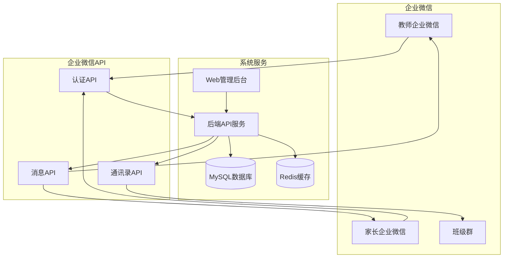

# 基于企业微信的轻量级教务系统方案

## 1. 方案背景

### 1.1 现状分析
- 机构规模：小型培训机构，单一门店
- 用户规模：教师10-20人，学员100-500人
- 现有工具：企业微信（内部办公 + 班级群）
- 预算限制：有限，需要性价比高的解决方案

### 1.2 核心需求
- 与企业微信深度集成
- 教师通过企业微信接收通知
- 家长通过企业微信接收通知
- 支持后续扩展（教师培训等）
- 低成本快速上线

## 2. 企业微信能力分析

### 2.1 可用API能力

| API类别 | 功能 | 免费额度 | 应用场景 |
|---------|------|----------|----------|
| 身份验证 | 获取用户信息 | 无限制 | 教师登录认证 |
| 通讯录管理 | 同步组织架构 | 无限制 | 自动同步教师信息 |
| 应用消息 | 发送应用消息 | 5万/月 | 发送上课提醒 |
| 外部联系人 | 管理家长联系人 | 无限制 | 家长通知 |
| 群聊管理 | 创建班级群 | 无限制 | 自动建班群 |
| 日程管理 | 创建日程提醒 | 无限制 | 课程安排提醒 |
| 审批流 | 自定义审批 | 无限制 | 请假审批 |

### 2.2 限制说明
- 消息推送频率：每个应用每分钟最多2000条
- 外部联系人数量：每个企业最多1万个
- API调用频率：部分接口有频次限制
- 自定义应用：需要企业认证（免费）

## 3. 系统架构设计

### 3.1 技术栈选择（精简版）

```yaml
后端:
  框架: Spring Boot 2.7 (稳定版本)
  数据库: MySQL 8.0 (易维护)
  缓存: Redis (单机版)
  部署: Docker + 阿里云ECS

前端:
  Web管理端: Vue 3 + Element Plus
  教师端: 企业微信小程序/H5
  家长端: 企业微信小程序/H5

企业微信集成:
  认证方式: OAuth2.0授权登录
  消息推送: 应用消息接口
  通讯录同步: 通讯录API
```

### 3.2 系统架构图



## 4. 核心功能模块

### 4.1 第一阶段：基础教务管理（1个月）

1. **教师端功能**
   - 课程表查看
   - 学员签到
   - 上课提醒
   - 简易考勤

2. **管理端功能**
   - 课程管理
   - 教师管理
   - 学员管理
   - 班级管理

3. **通知功能**
   - 上课提醒（提前30分钟）
   - 学员生日提醒
   - 排课变更通知

### 4.2 第二阶段：家校互动（2周）

1. **家长端功能**
   - 课表查看
   - 作业通知
   - 成绩查询
   - 请假申请

2. **互动功能**
   - 班级作业发布
   - 学员表现反馈
   - 照片分享
   - 一对一沟通

### 4.3 第三阶段：扩展功能（按需）

1. **教师培训系统**
   - 培训课程管理
   - 学习进度跟踪
   - 考核评价
   - 证书管理

2. **财务功能**
   - 课程收费
   - 考勤统计
   - 课时消耗
   - 收入报表

## 5. 详细设计方案

### 5.1 用户体系设计

```yaml
用户角色:
  超级管理员:
    权限: 系统配置、用户管理、数据管理
    登录方式: 企业微信 + 密码

  校长/教务主管:
    权限: 课程管理、教师管理、班级管理
    登录方式: 企业微信

  教师:
    权限: 查看课表、考勤、布置作业
    登录方式: 企业微信

  家长:
    权限: 查看课表、作业、请假
    登录方式: 企业微信（外部联系人）
```

### 5.2 数据库设计（精简版）

```sql
-- 教师表（同步自企业微信）
CREATE TABLE teacher (
    id BIGINT PRIMARY KEY AUTO_INCREMENT,
    user_id VARCHAR(64) UNIQUE NOT NULL COMMENT '企微用户ID',
    name VARCHAR(50) NOT NULL COMMENT '姓名',
    mobile VARCHAR(20) COMMENT '手机号',
    avatar VARCHAR(500) COMMENT '头像',
    position VARCHAR(100) COMMENT '职位',
    status TINYINT DEFAULT 1 COMMENT '状态',
    created_at TIMESTAMP DEFAULT CURRENT_TIMESTAMP
);

-- 学员表
CREATE TABLE student (
    id BIGINT PRIMARY KEY AUTO_INCREMENT,
    name VARCHAR(50) NOT NULL COMMENT '姓名',
    nickname VARCHAR(50) COMMENT '小名',
    gender TINYINT COMMENT '性别',
    birthday DATE COMMENT '生日',
    mobile VARCHAR(20) COMMENT '手机号',
    parent_name VARCHAR(50) COMMENT '家长姓名',
    parent_wxid VARCHAR(64) COMMENT '家长企微ID',
    join_date DATE COMMENT '入学日期',
    created_at TIMESTAMP DEFAULT CURRENT_TIMESTAMP
);

-- 课程表
CREATE TABLE course (
    id BIGINT PRIMARY KEY AUTO_INCREMENT,
    name VARCHAR(100) NOT NULL COMMENT '课程名称',
    color VARCHAR(10) DEFAULT '#409EFF' COMMENT '显示颜色',
    duration INT DEFAULT 60 COMMENT '课程时长(分钟)',
    max_students INT DEFAULT 30 COMMENT '最大人数',
    price DECIMAL(10,2) COMMENT '课程价格',
    status TINYINT DEFAULT 1 COMMENT '状态',
    created_at TIMESTAMP DEFAULT CURRENT_TIMESTAMP
);

-- 教室表
CREATE TABLE classroom (
    id BIGINT PRIMARY KEY AUTO_INCREMENT,
    name VARCHAR(50) NOT NULL COMMENT '教室名称',
    capacity INT DEFAULT 30 COMMENT '容纳人数',
    equipment TEXT COMMENT '设备信息',
    status TINYINT DEFAULT 1 COMMENT '状态',
    created_at TIMESTAMP DEFAULT CURRENT_TIMESTAMP
);

-- 课程安排表
CREATE TABLE schedule (
    id BIGINT PRIMARY KEY AUTO_INCREMENT,
    course_id BIGINT NOT NULL COMMENT '课程ID',
    teacher_id BIGINT NOT NULL COMMENT '教师ID',
    classroom_id BIGINT NOT NULL COMMENT '教室ID',
    start_time DATETIME NOT NULL COMMENT '开始时间',
    end_time DATETIME NOT NULL COMMENT '结束时间',
    student_ids TEXT COMMENT '学员ID列表',
    status TINYINT DEFAULT 1 COMMENT '状态',
    created_at TIMESTAMP DEFAULT CURRENT_TIMESTAMP,
    INDEX idx_teacher_time (teacher_id, start_time),
    INDEX idx_classroom_time (classroom_id, start_time)
);

-- 考勤记录表
CREATE TABLE attendance (
    id BIGINT PRIMARY KEY AUTO_INCREMENT,
    schedule_id BIGINT NOT NULL COMMENT '课程安排ID',
    student_id BIGINT NOT NULL COMMENT '学员ID',
    status TINYINT NOT NULL COMMENT '1:出勤 2:请假 3:旷课',
    check_time DATETIME COMMENT '签到时间',
    notes TEXT COMMENT '备注',
    created_at TIMESTAMP DEFAULT CURRENT_TIMESTAMP,
    UNIQUE KEY uk_schedule_student (schedule_id, student_id)
);

-- 作业表
CREATE TABLE homework (
    id BIGINT PRIMARY KEY AUTO_INCREMENT,
    schedule_id BIGINT NOT NULL COMMENT '课程安排ID',
    title VARCHAR(200) NOT NULL COMMENT '作业标题',
    content TEXT COMMENT '作业内容',
    images TEXT COMMENT '图片URL列表',
    deadline DATETIME COMMENT '截止时间',
    created_by BIGINT NOT NULL COMMENT '布置人ID',
    created_at TIMESTAMP DEFAULT CURRENT_TIMESTAMP
);

-- 通知消息表
CREATE TABLE notification (
    id BIGINT PRIMARY KEY AUTO_INCREMENT,
    type TINYINT NOT NULL COMMENT '1:上课提醒 2:作业 3:通知',
    receiver_id VARCHAR(64) NOT NULL COMMENT '接收人企微ID',
    title VARCHAR(200) NOT NULL COMMENT '标题',
    content TEXT COMMENT '内容',
    url VARCHAR(500) COMMENT '跳转链接',
    sent_at TIMESTAMP NULL COMMENT '发送时间',
    status TINYINT DEFAULT 0 COMMENT '0:未发送 1:已发送',
    created_at TIMESTAMP DEFAULT CURRENT_TIMESTAMP
);
```

### 5.3 企业微信集成方案

```java
// 企业微信配置
@Component
public class WeWorkConfig {

    @Value("${wework.corp-id}")
    private String corpId;

    @Value("${wework.corp-secret}")
    private String corpSecret;

    @Value("${wework.agent-id}")
    private Integer agentId;

    // 获取访问令牌
    public String getAccessToken() {
        String url = "https://qyapi.weixin.qq.com/cgi-bin/gettoken?corpid=" + corpId + "&corpsecret=" + corpSecret;
        // 调用API获取access_token
    }

    // 发送应用消息
    public void sendMessage(String userId, String message) {
        // 构造消息体
        // 调用发送消息API
    }
}
```

### 5.4 消息推送策略

```java
// 上课提醒任务
@Component
public class ClassReminderTask {

    @Scheduled(fixedRate = 300000) // 每5分钟执行一次
    public void remindClass() {
        // 查询30分钟后的课程
        List<Schedule> schedules = scheduleMapper.findUpcomingClasses(30);

        for (Schedule schedule : schedules) {
            // 给教师发送提醒
            String teacherWxId = teacherMapper.getWxIdById(schedule.getTeacherId());
            weWorkService.sendMessage(teacherWxId, buildTeacherReminder(schedule));

            // 给家长发送提醒
            List<Student> students = schedule.getStudents();
            for (Student student : students) {
                if (StringUtils.isNotBlank(student.getParentWxId())) {
                    weWorkService.sendMessage(student.getParentWxId(), buildParentReminder(schedule, student));
                }
            }
        }
    }
}
```

## 6. 前端设计方案

### 6.1 教师端（企业微信小程序）

```vue
<!-- 教师端首页 -->
<template>
  <view class="teacher-home">
    <!-- 快捷入口 -->
    <view class="quick-actions">
      <view class="action-item" @tap="goToSchedule">
        <image src="/images/schedule.png" />
        <text>今日课表</text>
      </view>
      <view class="action-item" @tap="goToAttendance">
        <image src="/images/attendance.png" />
        <text>考勤签到</text>
      </view>
      <view class="action-item" @tap="goToHomework">
        <image src="/images/homework.png" />
        <text>布置作业</text>
      </view>
      <view class="action-item" @tap="goToStudents">
        <image src="/images/students.png" />
        <text>我的学员</text>
      </view>
    </view>

    <!-- 今日课程 -->
    <view class="today-classes">
      <view class="section-title">今日课程</view>
      <view
        v-for="cls in todayClasses"
        :key="cls.id"
        class="class-item"
        @tap="goToClassDetail(cls.id)"
      >
        <view class="class-time">{{ cls.startTime }} - {{ cls.endTime }}</view>
        <view class="class-info">
          <text class="course-name">{{ cls.courseName }}</text>
          <text class="classroom">{{ cls.classroom }}</text>
        </view>
        <view class="student-count">{{ cls.studentCount }}人</view>
      </view>
    </view>

    <!-- 通知消息 -->
    <view class="notifications">
      <view class="section-title">通知消息</view>
      <view
        v-for="msg in messages"
        :key="msg.id"
        class="msg-item"
        @tap="readMessage(msg)"
      >
        <view class="msg-title">{{ msg.title }}</view>
        <view class="msg-time">{{ msg.time }}</view>
      </view>
    </view>
  </view>
</template>

<script>
export default {
  data() {
    return {
      todayClasses: [],
      messages: []
    }
  },

  onLoad() {
    this.loadData();
  },

  methods: {
    async loadData() {
      // 获取今日课表
      this.todayClasses = await this.api.getTodayClasses();

      // 获取通知消息
      this.messages = await this.api.getMessages();
    },

    goToSchedule() {
      wx.navigateTo({ url: '/pages/schedule/schedule' });
    },

    goToAttendance() {
      // 定位到当前课程
      wx.scanCode({
        success: (res) => {
          // 扫描教室二维码签到
          this.api.checkIn(res.result);
        }
      });
    }
  }
}
</script>
```

### 6.2 管理后台（Web端）

```vue
<!-- 课程管理页面 -->
<template>
  <div class="course-management">
    <!-- 搜索栏 -->
    <el-form inline>
      <el-form-item>
        <el-input v-model="searchKeyword" placeholder="搜索课程名称" />
      </el-form-item>
      <el-form-item>
        <el-button type="primary" @click="handleSearch">搜索</el-button>
        <el-button type="success" @click="showAddDialog">新增课程</el-button>
      </el-form-item>
    </el-form>

    <!-- 课程列表 -->
    <el-table :data="courses" stripe>
      <el-table-column prop="name" label="课程名称" />
      <el-table-column prop="duration" label="时长(分钟)" />
      <el-table-column prop="price" label="价格" />
      <el-table-column prop="maxStudents" label="最大人数" />
      <el-table-column prop="status" label="状态">
        <template #default="{ row }">
          <el-tag :type="row.status === 1 ? 'success' : 'info'">
            {{ row.status === 1 ? '启用' : '停用' }}
          </el-tag>
        </template>
      </el-table-column>
      <el-table-column label="操作" width="200">
        <template #default="{ row }">
          <el-button size="small" @click="editCourse(row)">编辑</el-button>
          <el-button size="small" type="danger" @click="deleteCourse(row)">删除</el-button>
        </template>
      </el-table-column>
    </el-table>

    <!-- 新增/编辑对话框 -->
    <el-dialog
      v-model="dialogVisible"
      :title="isEdit ? '编辑课程' : '新增课程'"
      width="500px"
    >
      <el-form :model="form" label-width="100px">
        <el-form-item label="课程名称">
          <el-input v-model="form.name" />
        </el-form-item>
        <el-form-item label="课程时长">
          <el-input-number v-model="form.duration" :min="30" />
        </el-form-item>
        <el-form-item label="最大人数">
          <el-input-number v-model="form.maxStudents" :min="1" />
        </el-form-item>
        <el-form-item label="课程价格">
          <el-input-number v-model="form.price" :precision="2" />
        </el-form-item>
        <el-form-item label="显示颜色">
          <el-color-picker v-model="form.color" />
        </el-form-item>
      </el-form>
      <template #footer>
        <el-button @click="dialogVisible = false">取消</el-button>
        <el-button type="primary" @click="saveCourse">确定</el-button>
      </template>
    </el-dialog>
  </div>
</template>
```

## 7. 部署方案

### 7.1 服务器配置（最小化）

| 配置项 | 规格 | 费用（月） |
|--------|------|------------|
| ECS服务器 | 2核4G | 200元 |
| RDS数据库 | 1核2G | 150元 |
| 域名SSL | - | 100元/年 |
| **合计** | - | **350元/月** |

### 7.2 Docker部署配置

```yaml
# docker-compose.yml
version: '3.8'

services:
  app:
    build: .
    ports:
      - "8080:8080"
    environment:
      - SPRING_PROFILES_ACTIVE=prod
      - MYSQL_HOST=mysql
      - REDIS_HOST=redis
    depends_on:
      - mysql
      - redis

  mysql:
    image: mysql:8.0
    environment:
      - MYSQL_ROOT_PASSWORD=edu123456
      - MYSQL_DATABASE=edu_wework
    volumes:
      - mysql_data:/var/lib/mysql
      - ./init.sql:/docker-entrypoint-initdb.d/init.sql

  redis:
    image: redis:7-alpine
    volumes:
      - redis_data:/data

volumes:
  mysql_data:
  redis_data:
```

## 8. 开发计划

### 8.1 第一阶段：基础功能（3周）

| 时间 | 内容 | 产出 |
|------|------|------|
| 第1周 | 环境搭建、企业微信对接 | 开发环境完成、认证打通 |
| 第2周 | 教师端核心功能 | 课表、考勤、消息提醒 |
| 第3周 | 管理后台 | 课程、教师、学员管理 |

### 8.2 第二阶段：家校互动（2周）

| 时间 | 内容 | 产出 |
|------|------|------|
| 第4周 | 家长端小程序 | 课表查看、消息接收 |
| 第5周 | 作业系统 | 作业发布、提交、批改 |

### 8.3 第三阶段：优化扩展（2周）

| 时间 | 内容 | 产出 |
|------|------|------|
| 第6周 | 教师培训模块 | 培训课程管理 |
| 第7周 | 系统优化 | 性能优化、Bug修复 |

## 9. 成本预算

### 9.1 开发成本

| 项目 | 费用 | 说明 |
|------|------|------|
| 开发人员 | 3人 × 1.5个月 | 全栈1人 + 后端1人 + 前端1人 |
| 人力成本 | 15万元 | 平均3万/人/月 |
| 服务器费用 | 0.35万元/月 | 第一年免费额度 |
| 其他费用 | 1万元 | 域名、SSL等 |
| **总计** | **17万元** | 不到原方案5% |

### 9.2 运营成本

| 项目 | 月费用 | 年费用 |
|------|--------|--------|
| 服务器 | 350元 | 4,200元 |
| 企业微信 | 免费 | 免费 |
| 维护人员 | 0.5人 | 6万元 |
| **合计** | **5,350元** | **64,200元** |

## 10. 实施优势

1. **成本极低**
   - 开发成本：15-20万（vs 400万）
   - 月运营成本：350元（vs 数万元）

2. **快速上线**
   - 7周即可完成核心功能
   - 利用现有企业微信，无需用户教育

3. **易用性强**
   - 教师无需额外安装APP
   - 统一的工作入口

4. **扩展性好**
   - 支持后续功能扩展
   - 可接入更多企业微信能力

这个方案完美契合您小型培训机构的实际需求，低成本、快速落地、易于使用，同时保留了后续扩展的可能性。